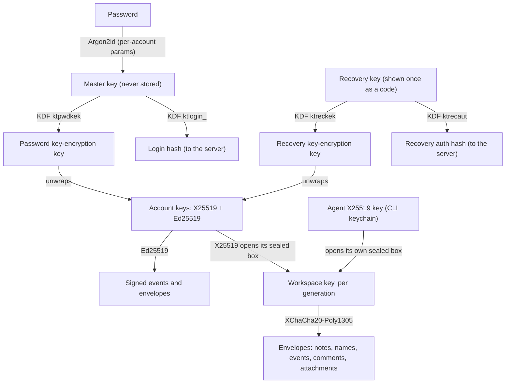
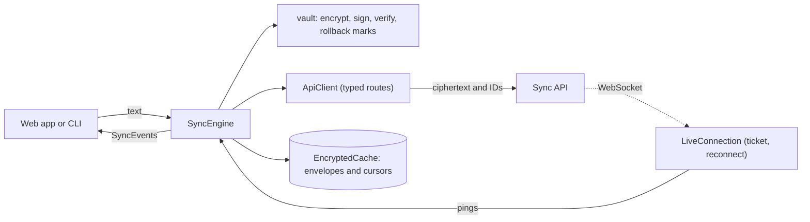

# Developing knowtarium

Notes for working on this repo. The user-facing page (what the CLI does, how to install it) is
[README.md](README.md), which npm shows; releasing is in [RELEASING.md](RELEASING.md).

The Knowtarium SDK is one npm package, `knowtarium`, with the code every Knowtarium client shares
(end-to-end encryption, the sync protocol, the OKF format logic and the sync client) and the
`knowtarium` command-line tool.

It is consumed by the web app (`knowtarium-web`, `apps/web`), the sync API (`knowtarium-sync`,
`apps/sync`) and later the remote connector. While those are being built they link a local checkout
of this repo; later they install it from npm. It is not published yet: `package.json` stays
`"private": true` until the first release (see `RELEASING.md`). The license is MIT (`LICENSE`).

Check this repo out as `app/` next to `web/` and `sync/`: until the package is on npm, they link it as
`../app`.

## Exports

| Import                | Source             | What it holds                                                    |
| --------------------- | ------------------ | ---------------------------------------------------------------- |
| `knowtarium`          | `src/index.ts`     | Re-exports `knowtarium/core`                                     |
| `knowtarium/crypto`   | `src/crypto/`      | Key derivation, key wrapping, blob encryption and signing        |
| `knowtarium/protocol` | `src/protocol/`    | The sync API contract: route table, zod schemas, error codes     |
| `knowtarium/core`     | `src/core/`        | OKF format logic, trust and verification, search, graph data     |
| `knowtarium/client`   | `src/client/`      | API client, vault helpers, sync engine, live pings, cache        |
| `knowtarium` (binary) | `src/cli/index.ts` | The CLI: `connect`, `agents`, `status`, `disconnect`, `validate` |

Everything is ESM with type declarations, built to `dist/` (`dist/<name>/index.js` and `.d.ts`).
The sync API imports only `knowtarium/protocol`, so it has no code path that could decrypt. ESLint
lets `src/protocol` import only its own files (no `../` imports, no `node:crypto`, no libsodium),
and `pnpm test:dist` fails if `dist/protocol` shares any module with `dist/crypto`.

## Encryption: `knowtarium/crypto`

The one place Knowtarium clients derive, wrap and use keys, with libsodium only
(`libsodium-wrappers-sumo`, the build with Argon2id). Await `ready()` once; everything after it is
synchronous. Argon2id blocks the thread it runs on, so browsers should call `createAccount`,
`changePassword` and `derivePasswordSecrets` from a Web Worker. Errors are `CryptoError`s with a
`code`; their messages never contain keys, plaintext or codes.

### Key model



The KDF is libsodium's `crypto_kdf` (keyed BLAKE2b, 8-byte context, subkey id 1), so the value the
server checks is independent of every key that decrypts. Argon2id params are stored per account as
`{ algorithm: "argon2id13", opsLimit, memLimit, salt }` (salt: 16 random bytes, base64url). New
accounts get 3 passes over 64 MiB (RFC 9106's memory-constrained recommendation; libsodium uses one
lane). That is also the floor: clients refuse weaker params, so a malicious server can't downgrade
them, and refuse more than 20 passes or 1 GiB. `changePassword` re-derives with the current defaults,
which is how the work factor gets raised later. Passwords are NFKC-normalized first.

### Formats

Every format starts with a version byte or string, so data written today stays readable after a
change.

| What                  | Bytes                                                                                                                                                                                                              |
| --------------------- | ------------------------------------------------------------------------------------------------------------------------------------------------------------------------------------------------------------------ |
| Blob envelope         | `0x01` ‖ key generation (uint32 BE) ‖ nonce (24) ‖ XChaCha20-Poly1305 ciphertext; associated data: the 5 header bytes ‖ encoded blob context                                                                       |
| Blob context          | u32 length ‖ kind ‖ u32 length ‖ workspace id ‖ u32 length ‖ id, then u32 chunk index ‖ u32 chunk count for `attachment_chunk` (UTF-8, big-endian lengths)                                                         |
| Wrapped account keys  | `0x01` ‖ nonce (24) ‖ XChaCha20-Poly1305 of X25519 private key (32) ‖ Ed25519 seed (32); AD: `0x01` ‖ `knowtarium account keys <purpose>`                                                                          |
| Wrapped workspace key | `crypto_box_seal` of `0x01` ‖ generation (uint32 BE) ‖ key (32) ‖ UTF-8 workspace id, plus the owner's signed `wrapped_key` and `key_generation` envelopes                                                         |
| Signed event          | `{ version: 1, event, signature }`, Ed25519 (base64url) over UTF-8 `knowtarium-event-v1\n` + canonical JSON of `event`                                                                                             |
| Signed envelope       | `{ version: 1, envelope, signature }`, Ed25519 over UTF-8 `knowtarium-envelope-v1\n` + canonical JSON of the server-visible fields                                                                                 |
| Connect payload       | `0x01` ‖ nonce (24) ‖ XChaCha20-Poly1305 of JSON `{ token, ownerSigningPublicKey, wrapped, signed, signedGeneration }`; key: KDF `ktconnct` of the one-time secret; AD: `knowtarium-connect-v1\n` ‖ CLI public key |
| Recovery code         | 32-byte key ‖ 3-byte checksum (keyed BLAKE2b), Crockford base32, 14 groups of 4                                                                                                                                    |
| Connect code          | First 40 bits of keyed BLAKE2b of the CLI public key ‖ owner signing public key, Crockford base32, `ABCD-EFGH`                                                                                                     |

Every encrypt and decrypt takes a required blob context, `{ kind, workspaceId, id }`, with `kind`
one of `note`, `pending_change`, `title`, `folder_name`, `workspace_name`, `comment`, `event`,
`check`, `attachment_chunk` (which adds `chunkIndex` and `chunkCount`), `attachment_meta` (an
attachment's JSON metadata: file name, media type and size; its id is the attachment id),
`search_index` (a
client's serialized search index in its local encrypted cache; never uploaded), `graph_layout`
(a client's saved graph positions, local cache only too) or `agent_name` (the name a person gives a
connected agent; its id is the agent token's id). It is bound as
associated data, so the server can't serve one blob as another. `encryptAttachment` and `decryptAttachment`
chunk files; each chunk binds its index and the total count, so a dropped, reordered or extra chunk
fails. Nonces are random, so equal plaintexts never look equal.

**Attachments.** An attachment's metadata travels encrypted as `encMeta` (`createAttachment`,
`Attachment` and the changes feed's attachment entries): the JSON `{ name, type, sizeBytes }`,
with the file name within its folder normalized like a note's (`normalizeAttachmentName`, never
`.md`, unique in the folder with letter case ignored, which clients check since the server can't
read it); `encMeta` is bound to the attachment and its folder, so it doesn't open under another
folder. `knowtarium/client` has `uploadAttachment` (takes the folder's other names, `takenNames`;
encrypts the metadata and the chunks with
the current key, announces the upload so the quota is checked first, `StorageFullError` when
full, `AttachmentTooLargeError` over the limit, stores the chunks with progress and an abort
signal, then completes; a failure throws `AttachmentUploadError` carrying the prepared upload, and
`sendAttachmentUpload` resumes it where it stopped), `downloadAttachment` (the chunk count and
total size checked against the metadata before anything is fetched, every chunk decrypted,
`invalid_attachment` otherwise), `deleteAttachment` and
`encryptAttachmentMeta`/`decryptAttachmentMeta`. The sync engine reports `attachment` events with
the decrypted name, type and size and `createdAt` (from the changes feed's attachment entry; null
for an attachment cached before it was kept), so two attachments with the same name resolve to the
oldest, and keeps the attachments in its encrypted cache (metadata
still encrypted, decrypted on load). Core's `assetLocation(path)` and `attachmentKey` map an asset
link's resolved path to the folder and name to look the attachment up by.

Canonical JSON (what events and envelopes are signed over) is RFC 8785 restricted to integers:
keys sorted by UTF-16 code units, no whitespace, strings escaped as `JSON.stringify` does, numbers
only as safe integers, no `undefined`, lone surrogates or non-plain objects. `verifyEvent` needs the
signer's key from the server's account record, never one that came with the event.

A signed event travels inside encryption; a signed envelope is what the server itself can verify.
Its fields are only what the server may see, all strings or integers: `type`, `accountId`,
`workspaceId` and `createdAt` (UTC with milliseconds, exactly as `toISOString()` writes it) always,
plus the fields its type requires (`SIGNED_ENVELOPE_TYPES`) and nothing else, except the optional
fields in `SIGNED_ENVELOPE_OPTIONAL`, which are signed when present (`SIGNED_ENVELOPE_TOGETHER`
lists the ones that come as a pair). The server rebuilds each envelope from the request, so any
other field is refused, as are unknown types. `knowtarium/protocol` has the same table.

| Type             | Requires (optional in parentheses)                                                                                     |
| ---------------- | ---------------------------------------------------------------------------------------------------------------------- |
| `edited`         | `noteId`, `version`, `folderId`, `ciphertextSha256`                                                                    |
| `deleted`        | `noteId`, `version`                                                                                                    |
| `approved`       | `noteId`, `pendingId`, `version`, `folderId`, `ciphertextSha256`                                                       |
| `rejected`       | `noteId`, `pendingId` (`commentId` with the comment's hash, both or none)                                              |
| `commented`      | `commentId`, `revision`, `ciphertextSha256` (`noteId`)                                                                 |
| `recorded`       | `eventId`, `ciphertextSha256` (`noteId`)                                                                               |
| `wrapped_key`    | `recipient` (X25519 public key, base64url), `holder` (`"account"` or the token id), `generation`, `ciphertextSha256`   |
| `key_generation` | `generation`, `recipientsHash`, `keyCommitment`                                                                        |
| `token_revoked`  | `recipient` (the token's X25519 public key), `tokenId`                                                                 |
| `check_applied`  | `noteId`, `version`, `folderId`, `ciphertextSha256`, `checkId` (a write that applies an agent's passing check)         |
| `folder_created` | `folderId`, `ciphertextSha256` of the encrypted name (`parentId`)                                                      |
| `folder_moved`   | `folderId` (`parentId`, the destination)                                                                               |
| `agent_policy`   | `revision`, `policySha256` (the owner set the agent policy; protocol 2)                                                |
| `agent_key`      | `tokenId`, `signPublicKey`, `policyRevision` (the owner vouches for an agent's Ed25519 key and its policy floor)       |
| `agent_edited`   | `tokenId`, `noteId`, `version`, `folderId`, `ciphertextSha256`, `revision`, `policySha256` (signed by the agent's key) |

A folder at the workspace root has no `parentId` (never an empty or null one), so a signed
move always says where the folder goes.

`agent_edited` is the one envelope an agent signs, with its own Ed25519 key (made by the CLI at
connect time, sent in the fragment as `signPublicKey`), never the account's; it counts only under
a key an owner-signed `agent_key` vouches for, for the same `tokenId`. Its `accountId` is the
workspace owner's account, and `revision` and `policySha256` are the agent policy revision the
agent checked and its hash. `agent_key`'s `policyRevision` is the policy revision when the agent
connected: the agent never accepts a policy below it (nor below the highest one it has seen).
`agent_policy`, `agent_key` and `agent_edited` are protocol 2 types.
`policySha256` is `agentPolicySha256()` in `knowtarium/protocol` (Web Crypto, async): the
lowercase hex SHA-256 of the tag `knowtarium-agent-policy-v1\n` followed by the canonical JSON of
`{default, folders}`, where `folders` is the sorted list of every override's own hash (SHA-256 of
`knowtarium-agent-policy-folder-v1\n` and the canonical JSON of `{folderId, mode}`), pinned by
`agentPolicyHashes` in the vectors. Hashing each override first lets an agent, which reads only the
overrides inside its scope plus the hashes of the others, check the owner's signature.

`version` and `revision` are integers of 0 or more, `generation` of 1 or more.
`ciphertextSha256` is the lowercase hex SHA-256 of the uploaded bytes (`ciphertextSha256()`).
`recipientsHash` is the lowercase hex SHA-256 of the tag `knowtarium-recipients-v1\n` followed by
every X25519 public key the generation is wrapped for, deduplicated, sorted by bytes, each
prefixed with its length as a uint32 BE (`recipientsHash()`, pinned by `recipientsHashes` in the
vectors), so the owner signs exactly who holds a generation. A `wrapped_key`'s `holder` binds the
copy to who holds it, so a server can't move one agent's copy to another token's label.
`keyCommitment` is `workspaceKeyCommitment()`: the lowercase hex SHA-256 of the tag
`knowtarium-key-commitment-v1\n`, the generation (uint32 BE), the 32-byte key and the workspace
id (pinned by `keyCommitments` in the vectors). Requests that sign a generation send it as
`keyCommitment` (the server never has the key); every unwrap checks the key against it, so two
owner-signed key sets for one generation can't be swapped for each other.
The server (and `knowtarium/protocol`) rebuilds the message with sorted keys and `JSON.stringify`
per value and checks it with Web Crypto Ed25519, no libsodium needed. Clients use
`verifyEnvelopeFor(signed, key, expected)`, which also compares every field they know
independently, so a signature for one action or note never passes as another.

### Wrapped keys and connecting an agent

A sealed box doesn't prove who made it, so every wrapped workspace key travels with the owner's
signed `wrapped_key` envelope, and with the owner's signed `key_generation` for its generation
(`signKeyGeneration`, naming every recipient through `recipientsHash`: at workspace creation, on
every rotation, and again when a connect approval adds an agent to the current generation; the
server stores the latest one and returns it with every copy). `wrapAndSignWorkspaceKey` produces all three, and the
only public way to unwrap is `unwrapSignedWorkspaceKey`, which verifies both signatures before
opening the box and then checks the generation, so no generation is used without the owner's
signature. The owner's signing public key must come from a source the server can't
swap: the account's own keys, or the one the CLI pinned when it connected.

`knowtarium connect`: the CLI creates its X25519 keypair and a one-time secret
(`createConnectSecret()`) and puts both in the URL fragment of the connect link, which never
reaches the server. After approval, the browser calls `sealConnectPayload` with the agent token,
the owner's signing public key and the signed wrapped key, and sends the result to the CLI's
loopback port, or through the server's relay when loopback is unreachable. The bytes are the same
on both paths. The CLI calls `openConnectPayload`, which authenticates the payload with the
secret (so a relaying server can neither read nor forge it), verifies the owner's signature on the
wrapped key, unwraps it and returns the confirmation code. Both sides show
`connectConfirmationCode(cliPublicKey, ownerSigningPublicKey)` as a second, visual check. The CLI
then pins the owner's signing key.

### What the server gets, and what callers must do

Sign-up sends the KDF params, login hash, recovery auth hash, the two public keys and the two
wrapped copies of the account keys. Never the password, master key, key-encryption keys, recovery
key or code, or a private key. The server stores SHA-256 of the login hash and of the recovery
auth hash, and answers the pre-sign-in params request for unknown emails with stable fake params
(derived from the email with a server secret) so it doesn't reveal which emails have accounts.

The crypto can't stop a server from serving old but genuine data (rollback). Callers must:

- **Pin the account keys.** `unwrapAccountKeys` requires the expected public keys; take them from
  the device's own record after first sign-in, not only from the server.
- **Remember the highest KDF params seen per account** on each device and refuse lower ones at the
  next sign-in, on top of the fixed floor `assertKdfParams` enforces.
- **Never write with an older generation than the highest seen.** `unwrapSignedWorkspaceKey`
  already refuses a generation without the owner's signed `key_generation` envelope
  (`verifyKeyGeneration`), but a server can still withhold the newest one.
- **Require signed version metadata.** Accept a note version as current only with a signed
  `edited` or `approved` envelope whose `version` and `ciphertextSha256` match the blob, and never
  go back below the highest version seen for a note.

### Test vectors

`src/crypto/vectors.json` holds known-answer vectors for every format, plus tampered envelopes,
attachments and connect payloads and invalid codes, with the error each must raise.
`src/crypto/envelope-vectors.json` holds the canonical JSON and signed envelope vectors on their
own, so `knowtarium/protocol` tests its own canonicalizer against the same file. Change either
only together with a new format version. The Argon2id, Ed25519, X25519 and SHA-256 values were
cross-checked against `node:crypto`, and the signed envelopes against Web Crypto with a separate
canonicalizer. `pnpm test` runs the crypto tests in Node and again under happy-dom, and
`pnpm test:dist` checks the vectors against the built package.

## The protocol

`knowtarium/protocol` is the contract between the sync API and every client, built on
[zod](https://zod.dev) (its only dependency):

- **`routes`**: every route by name, with its method, path template (`:param`, as Hono reads it),
  who may call it (`none`, `session`, `agent`, `any`) and schemas for path params, query, headers,
  body and response. Raw bodies (note versions, pending changes, attachment chunks) are marked
  `RAW_BYTES`. `pathFor(routes.getWorkspace, { workspaceId })` fills a path; `RequestBody<R>` and
  `ResponseBody<R>` give the types. Paths are plural nouns; PATCH updates part of a resource. `listPending` and `listVersions` are paged (at most 1,000 per page; `since` is the last pending change's `seq` or the last version, `hasMore` says whether to ask again; `fetchPending` and `fetchVersions` in `knowtarium/client` follow the pages). `getVersions` (`POST /workspaces/:workspaceId/version-batches`) returns up to
  100 exact note versions at once as base64url JSON (`NoteCiphertext`), capped at 16 MiB per
  answer, with `omitted` naming what isn't there (delete markers, out of scope, over the cap); the
  signed events still come from `listEvents`, so every version is verified exactly like a single
  read.
- **Accounts** are [Better Auth](https://www.better-auth.com), mounted by the sync API at `/auth`.
  Its "password" is always the client-derived login hash. The protocol adds only what Better Auth
  lacks: `prelogin`, the `SignUpKeyMaterial` sign-up field, `changePassword` (swaps the login hash
  and wrapped keys at once), `replaceRecoveryKey` (`PUT /account/recovery-key`: a new recovery key
  while signed in, proving the current password; the client's `replaceRecoveryKey` derives it all
  from the unlocked keys and the password and returns the new code once accepted), `revokeSession` (`DELETE /account/sessions/:sessionId`) and recovery
  with the recovery key. Without the password and the recovery key, a person can start over:
  `requestAccountReset` (`POST /account-resets`) emails a single-use link, and
  `completeAccountReset` (`POST /account-reset-completions`, 410 `expired` for a used or old link)
  takes fresh key material made like at sign-up plus the link's `kts_` token, replacing the keys
  (nothing under the old ones can be read again). The client's `startOver` prepares and sends it
  (`prepareStartOver`, `requestStartOver`; it checks the answer names the account it started
  over), and `TrustState.acceptAccountReset` re-pins the new account keys on a device only with
  proof: the person's new password must unwrap the new `wrappedByMaster` into exactly the new
  public keys. Better Auth's password reset, change-password and `/revoke-session`
  endpoints are disabled (`BETTER_AUTH_DISABLED_PATHS`). The session cookie is `__Host-kt_session`
  (httpOnly, Secure, SameSite=Strict), and it is the only place a session token appears: no Better
  Auth response body carries one (session lists give `ses_` ids), so sessions are revoked by id.
  `DEFAULT_KDF_OPS_LIMIT` and `DEFAULT_KDF_MEM_LIMIT_BYTES` equal crypto's defaults
  (`src/kdf-defaults.test.ts` checks it), for the fake prelogin answer to unknown emails.
- **IDs** are `<prefix>_<26 base32 chars>` (`ws_`, `fld_`, `note_`, `tok_` and so on); `formatId`
  builds one from 16 random bytes the caller supplies. A create retried with the same ID and body
  returns the original result.
- **Errors** are `{ "error": { "code", "message", ... } }` with stable codes and statuses in
  `ERROR_STATUS` (`conflict` 409 carries `currentVersion`; the two plan limits answer 402 with the
  account's `plan` and `usage`: `quota_exceeded` for a write that would add data over the storage,
  `workspace_limit` for a workspace over the plan's limit). The MCP tools tell the agent either one
  in their own words (`src/cli/mcp/plan-limits.ts`: the limit, what is used, how to get more),
  never the server's text: only the plan ids the SDK knows (`PLAN_IDS`: `free`, `starter`,
  `pro`) are named, any other is "your plan", and the upgrade is offered only "if a larger plan is
  offered" (the 402 body says nothing about what is on sale), never on Pro. The storage text also
  points at shortening a workspace's history.
- **Plans**: every account is on `DEFAULT_PLAN`, Free (500 MB counted in binary units, so
  524,288,000 bytes, and one workspace), unless a subscription, an entitlement or an assigned plan
  says otherwise (Starter: 2 GB and five workspaces; Pro: 10 GB and no workspace limit, as the
  sync API's plan table has them). `getAccountPlan` answers the plan, the subscription (`status`,
  `planId` and `interval` it is billed as, `currentPeriodEnd`, `cancelAtPeriodEnd`, `graceEndsAt`,
  and `pendingChange` `{ planId, interval, appliesAt }` waiting for the renewal), the storage and
  workspaces used, `writable` (false once the storage is full), `offers` (every plan on sale,
  smallest first, each with its monthly and yearly `prices`: amount in the currency's smallest
  unit, currency, `month` or `year`; at most one per interval, `offerPrice` finds one) and
  `upgradePlans` (the offers that give more than the account's plan, listed also while a
  subscription is live). `workspaceLimitReached(usage)` says when a new workspace would be
  refused; `comparePlans` orders plans as the server does (storage, then workspaces, unlimited the
  most) and `planChangeEffect(from, to)` says whether a change applies now (`applied`: neither the
  plan nor the interval goes down) or at renewal (`scheduled`, also for another plan whose limits
  compare equal at the same interval); it is null only for the same plan and interval. Over a
  limit nothing is deleted; reads, export and deletes never stop.
- **Billing and revocation**: `createPortalSession` (`POST /billing/portal-sessions`) answers a
  billing portal link (https only; 404 without a subscription, 503 when the provider is down; the client's
  `createPortalSession` returns the URL). `startCheckout` (`POST /billing/checkout`, body
  `{ planId, interval }` from `offers`; the server resolves the Polar product, clients never see
  product ids) answers the payment provider's hosted checkout (Polar), https only; the sync API
  makes the checkout session with its own token and binds it to the signed-in account itself (403
  `email_not_verified` until the account's email is verified, 404 for a plan or interval not on
  sale, 409 `already_exists` while a subscription is live, 503 when checkout isn't configured or
  the provider is down). With a live subscription, `changePlan`
  (`POST /billing/subscription/change`, the same body) answers
  `{ effect: "applied", appliesAt: null }` for an upgrade, charged now, or
  `{ effect: "scheduled", appliesAt }` for anything else (409 `subscription_not_changeable`
  while paused, past due, unpaid or ending; 402 `payment_failed` when the difference couldn't be
  charged; the full list is at `ChangePlanRequest`), and
  `cancelPlanChange` (`DELETE /billing/subscription/change`) drops a scheduled change.
  `revokeToken` takes the owner's signed `token_revoked` (the signing headers, optional for
  older clients), which the server stores and returns in `listKeys`' `revocations`; the revoked
  token's copies stay listed with `revokedAt` until the next generation. It answers
  `mustRotateKey: { workspaceId }` when the owner must start a new key generation.
  `approveConnect` carries `generationSignedAt` and `generationSignature`: the current
  generation's `key_generation` signed again with the new agent's key in its recipient set
  (`prepareConnectGeneration` builds the key fields, the agent's `wrapped_key` with `holder` =
  its token id).
- **Agent attribution**: pending changes, check records, comments and events carry
  `authorTokenId`, the agent token whose bearer secret posted them (null for a person's comment
  or event), so the web can bind an agent's actor name to its token. The server asserts it from
  the request: it is attribution for display, not proof, since nothing signs it. The history
  entries (`CommentEntry`, `HistoryEventEntry`, `CheckEntry`) pass it through.
- **Agent policy and direct writes (protocol 2)**: `agent-policy.ts` has `AgentWriteMode`
  (`direct`, the default, or `review`), the `AgentPolicy` schema (a default plus up to 1,000
  folder overrides, a revision and the owner's signed `agent_policy`) and the pure resolver
  `effectiveMode(policy, ancestry)`: the nearest folder with an override wins, else the default;
  a missing policy reads as direct; an empty ancestry, a deleted folder in it or a chain cut off
  without verified ancestors reads as `review`. An override covers only its folder and what is
  stored under it (an override on the root folder never covers the other top-level folders); the
  whole workspace is `default`. An agent reads a view (`agentPolicyViewFor`, shared by the server
  and the web app): its overrides, the hashes of the others and the ids of the folders above its
  scope. `resolveAgentPolicyView` (shared by every client) checks it against the owner's
  signature and a revision floor, refuses a hidden override and derives the inherited modes
  itself; any problem reads as `review`. The folder parent chain stays server-asserted (the web
  app, which sees the whole tree, can detect a lie there). `getAgentPolicy` (with `?revision=`
  for an old revision) and `setAgentPolicy` (owner only, `baseRevision`, 409 `conflict` when
  stale) serve it. `writeNoteAsAgent` (`PUT .../notes/:noteId/agent-version`, the only route
  marked `agentSigns`) stores an agent's version signed `agent_edited` where the mode is
  `direct`. It answers `agent_key_required` (a token without a vouched key) or
  `approval_required` (the folder is `review`), and the CLI proposes instead; or
  `stale_agent_policy` (the policy changed), and the CLI fetches the policy, checks the mode again
  and retries. Agents never delete notes. A version 1 caller gets `unsupported_protocol` instead
  of a page holding an `agent_edited` event (`envelopeProtocolVersion`).
- **Deploy order for protocol changes**: the sync API first (it accepts the old and the new
  version), then the web app, then the npm release of the CLI, so no client ever speaks a version
  the server doesn't accept yet.
- **Headers**: every request sends `Knowtarium-Protocol-Version: 2` (the API also accepts 1),
  and every request that isn't a GET also sends `Knowtarium-Request: 1` (a CSRF guard). A
  person's write that applies an agent's passing check also sends `Knowtarium-Check-Id` (signed
  as `check_applied`, which makes the version but never confirms a person's entry; the server
  marks the record applied). An agent's direct write sends `Knowtarium-Agent-Policy-Revision`,
  the policy revision it checked. Note uploads send the base version as `If-Match: "3"` plus
  `Knowtarium-Folder-Id`, downloads return `ETag: "4"`, and 429 or 503 answers carry
  `Retry-After`. `REQUEST_HEADERS` and `RESPONSE_HEADERS` list them for CORS. Clients also read
  a weak `ETag: W/"4"` as version 4 (`parseResponseVersionTag`), since an edge that compresses
  the answer (Cloudflare) may weaken the tag. `If-Match` stays strong: clients send `"3"`, and
  `parseVersionTag` (what the server reads it with) accepts nothing else.
- **Signed envelopes**: a person's note writes and deletes, approvals, rejections, comments, events,
  folder creates and moves, every wrapped workspace key and every key generation
  (`generationSignedAt` and `generationSignature` on workspace creation and rotation, returned as
  `signedGeneration` with every wrapped key) carry an Ed25519 signature over an envelope the server
  rebuilds from the request (`signatures.ts` has the table). The signed text is
  `knowtarium-envelope-v1\n` plus the canonical JSON (sorted keys, no whitespace, strings and
  integers only), the same rules as `knowtarium/crypto`, whose type table it shares; hashes are
  lowercase hex. The server verifies it against the account's signing public key and clients verify
  it too. `src/envelope-vectors.test.ts` checks the protocol's canonicalizer, signing text and
  schemas against `src/crypto/envelope-vectors.json`.
- **Connect**: the CLI listens on 127.0.0.1 and opens the web app with its public key, port and a
  one-time secret in the URL fragment, which no server sees. The server only registers the
  request, the token (by the hash of its secret) and its scope. The browser delivers the token
  secret, the owner's signing key and the signed wrapped key straight to the CLI (`loopback.ts`).
  If that fails, both sides show a confirmation code the person matches, and the browser relays a
  sealed, authenticated payload through the server. The CLI pins the owner's signing key from that
  delivery, never from a server response.
- **Strict CSP**: loading the protocol calls `z.config({ jitless: true })` before any schema is
  built, so zod never compiles code or probes `Function` (a strict Content Security Policy
  reports even the probe). The setting is global to the app's zod.
- **Pending changes** carry the agent's random 16-byte nonce (`Knowtarium-Pending-Nonce`, stored
  as `clientNonce`), bound into the proposal's encryption context with its note, folder and base
  version. Changes, events, comments and check records are paged by `seq` (`since`, `limit` up
  to 1000, `hasMore`). A retried create of an event, comment or check (same ID, same body)
  answers the stored record at its own `seq`.
- **No plaintext**: every user-content field is ciphertext, named `ciphertext` or `enc*`. A test
  walks every schema and fails on a field like `title` or `name`, on ciphertext under a plain name,
  and on any string that isn't a known format (IDs, timestamps, hashes, keys, secrets, ciphertext).

## The client: `knowtarium/client`

The layer the web app and the CLI share on top of `crypto` and `protocol`. Only ciphertext, IDs
and numbers leave it; plaintext stays in the caller's memory. Like the rest of the library it has
no DOM or Node types: `fetch`, WebSockets, timers and storage are injected.



| Module (`src/client/`) | What it does                                                                                                                                                                                                                                                                                                                                                                                                                                                                                                                                                                                                                                                                                                                                                                                                                                                                                                                                                                                                                                                                                                                                                                                                                                                                                                                                                                                                                                                                                                                                                                                                                                                                                                                                                                                                                                                                                                                                                                                                                                                                                                                                                                                                                                                                                                                                                                                                                                                                                                                                                                                                                                                                                                                                                                                                                                 |
| ---------------------- | -------------------------------------------------------------------------------------------------------------------------------------------------------------------------------------------------------------------------------------------------------------------------------------------------------------------------------------------------------------------------------------------------------------------------------------------------------------------------------------------------------------------------------------------------------------------------------------------------------------------------------------------------------------------------------------------------------------------------------------------------------------------------------------------------------------------------------------------------------------------------------------------------------------------------------------------------------------------------------------------------------------------------------------------------------------------------------------------------------------------------------------------------------------------------------------------------------------------------------------------------------------------------------------------------------------------------------------------------------------------------------------------------------------------------------------------------------------------------------------------------------------------------------------------------------------------------------------------------------------------------------------------------------------------------------------------------------------------------------------------------------------------------------------------------------------------------------------------------------------------------------------------------------------------------------------------------------------------------------------------------------------------------------------------------------------------------------------------------------------------------------------------------------------------------------------------------------------------------------------------------------------------------------------------------------------------------------------------------------------------------------------------------------------------------------------------------------------------------------------------------------------------------------------------------------------------------------------------------------------------------------------------------------------------------------------------------------------------------------------------------------------------------------------------------------------------------------------------- |
| `api`                  | `createApiClient({ baseUrl, fetch, auth })` and `client.call(routes.x, { params, query, headers, body })`, typed from the route table. Path params are checked against the ID schemas and bodies and headers against the route schemas before sending; responses are validated. `auth` is `session` (cookie, `credentials: "include"`) or `agent` (Bearer token). Fixed headers (protocol version, `Knowtarium-Request: 1` on every non-GET, the token) are applied last; requests use `cache: "no-store"` and `redirect: "error"`.                                                                                                                                                                                                                                                                                                                                                                                                                                                                                                                                                                                                                                                                                                                                                                                                                                                                                                                                                                                                                                                                                                                                                                                                                                                                                                                                                                                                                                                                                                                                                                                                                                                                                                                                                                                                                                                                                                                                                                                                                                                                                                                                                                                                                                                                                                          |
| `errors`               | `SyncApiError` (the protocol error `code`, with `currentVersion` on a conflict), `NetworkError`, `InvalidResponseError`, `RequestValidationError`, and `VaultError` for data that fails a client check.                                                                                                                                                                                                                                                                                                                                                                                                                                                                                                                                                                                                                                                                                                                                                                                                                                                                                                                                                                                                                                                                                                                                                                                                                                                                                                                                                                                                                                                                                                                                                                                                                                                                                                                                                                                                                                                                                                                                                                                                                                                                                                                                                                                                                                                                                                                                                                                                                                                                                                                                                                                                                                      |
| `vault`                | Encrypt and decrypt note files (`encryptNote` takes `{ name, text }`, `decryptNote` returns them, `invalid_note` for one it can't read), pending changes, titles, folder and workspace names, comments, events, checks and the search index, each with its blob context. Builders for every signed envelope in the protocol table; each takes an optional `signedAt` (UTC with milliseconds, within `SIGNATURE_MAX_SKEW_SECONDS` of now, else `RequestValidationError` before signing) so content written in the same save can name the signature's own time without a shared clock, and the engine passes it through (`writeNote`, `deleteNote`, `approvePending`, `rejectPending`, `restoreVersion`, `addComment`, `updateComment`, `prepareFolder`, `prepareFolderUpdate`). `openWorkspaceKeyring` verifies the owner's signatures on every wrapped key before unwrapping. `encryptLocalBlob` and `decryptLocalBlob` handle blobs that stay in the local cache (`LOCAL_BLOB_KINDS`: `search_index`, `graph_layout`), and `EncryptedCache.putLocalBlob`, `getLocalBlob`, `getLocalText` and `deleteLocalBlob` store them by kind and id (`ws/<workspace>/local/<kind>/<id>`). `generationRecipients` returns the owner-signed recipient set of one generation from `listKeys`' `recipients` (every copy verified against the owner key for the holder its label claims, the set matching a signed `recipientsHash`, an `account` copy only with the owner's own box key). `rotationRecipients` takes that generation (from the caller's own keyring, never the server), `listKeys`' `revocations` and an `exclude` set, and returns who the next generation is wrapped for, without any signed-revoked, excluded or server-marked revoked key or token. `prepareRotation` builds the `rotateWorkspaceKey` request; `rotateWorkspace` rotates, leaving out every revocation `TrustState` remembers; `revokeAndRotate` remembers the revocation, signs `token_revoked` and revokes (skipped when a valid one is listed) and rotates, and resumes where it stopped when run again; `prepareConnectGeneration` builds `approveConnect`'s key fields. `currentGenerationState(recipients, revocations, { ...expectation, trust })` is the check `createKeyProvider` runs on every owner refresh (verifies the current generation's signed set, remembers signed revocations, records the set) and returns `{ rotationPending }`; a session key provider of its own reuses it and refuses writes while it is true. `replaceRecoveryKey` sends idempotently and, when the answer is lost, throws `RecoveryKeyReplacementError` carrying the prepared request, which `sendRecoveryKeyReplacement` retries unchanged. `encryptAgentName` and `decryptAgentName` handle a connected agent's name. `TrustState` pins keys and keeps high-water marks. |
| `sync`                 | `SyncEngine`: pulls the changes feed from a cursor (each page's versions fetched up to 100 per `getVersions` request, four requests at a time, falling back to single reads for what a batch leaves out or past the 16 MiB cap, which the client enforces while decoding; a 404 or 405 turns batching off for that client for 15 minutes), verifies and decrypts note versions, writes with `If-Match` (a 409 returns both versions), submits proposals (agent), reads, approves and rejects them (session), and reports `SyncEvent`s through `subscribe` and `on`.                                                                                                                                                                                                                                                                                                                                                                                                                                                                                                                                                                                                                                                                                                                                                                                                                                                                                                                                                                                                                                                                                                                                                                                                                                                                                                                                                                                                                                                                                                                                                                                                                                                                                                                                                                                                                                                                                                                                                                                                                                                                                                                                                                                                                                                                          |
| `live`                 | `LiveConnection`: a single-use ticket per connection, pings, reconnects with backoff (reset only after a connection stayed open 30 s), stops for good when access is revoked. `standardSocketFactory(WebSocket)` adapts any standard WebSocket.                                                                                                                                                                                                                                                                                                                                                                                                                                                                                                                                                                                                                                                                                                                                                                                                                                                                                                                                                                                                                                                                                                                                                                                                                                                                                                                                                                                                                                                                                                                                                                                                                                                                                                                                                                                                                                                                                                                                                                                                                                                                                                                                                                                                                                                                                                                                                                                                                                                                                                                                                                                              |
| `cache`                | `EncryptedCache` over a `CacheAdapter` (get, put, delete, list of bytes by key; `MemoryCacheAdapter` included). It refuses bytes that aren't envelopes and builds keys only from validated IDs.                                                                                                                                                                                                                                                                                                                                                                                                                                                                                                                                                                                                                                                                                                                                                                                                                                                                                                                                                                                                                                                                                                                                                                                                                                                                                                                                                                                                                                                                                                                                                                                                                                                                                                                                                                                                                                                                                                                                                                                                                                                                                                                                                                                                                                                                                                                                                                                                                                                                                                                                                                                                                                              |

Retries: GET requests (and calls marked `idempotent`, like creates with a client-made ID) are
retried after network errors, timeouts and 500, 502, 503 and 504 with exponential backoff and
jitter; any request is retried after 429 or 503 with a `Retry-After` of up to a minute. A write
whose repeat would answer differently is never repeated. Each attempt has a timeout (30 s by
default, `timeoutMs` per client or per call, body included), and a call takes an `AbortSignal`.

What the client checks, since the server could serve old but genuine data:

- **Wrapped keys**: every copy needs the owner's valid `wrapped_key` and `key_generation`
  signatures for this client's own public key, with the owner key from a source the server can't
  swap (the web app's own account key, the key the CLI pinned at connect), never
  `Workspace.ownerSignPublicKey`.
- **Recipient sets**: the owner's flows record each generation's verified recipient set in
  `TrustState` (`acceptGenerationSet`) and refuse (`rollback`) an older generation or a set for
  the same generation that leaves out a key seen before (a set only grows within a generation, when
  an agent connects). Revocations made on a device are remembered there and left out of every
  later rotation from it, and a set may not grow by a revoked key, except one this device itself
  signed into that generation (`prepareConnectGeneration` remembers it, `rememberApproval`, before
  the approval is sent): revoking an agent it just approved but couldn't deliver, before it saw
  the grown set, still revokes and rotates it out. Keys: a keyring refuses two
  different keys for one generation and pins each generation's key commitment
  (`acceptKeyCommitment`, `pin_mismatch` for another key later); a rotation pins the key it just
  created and checks the server serves exactly that key, so a rotation body the server kept after
  answering an error can't replace it. A rotation's new generation becomes
  the device's high-water mark as soon as the server accepts it, so a server that answers and then
  serves only the old generation gets `rollback`. Rotation pending: on every keyring refresh the
  owner's device checks the current generation's signed recipient set, remembers every valid
  signed revocation it sees, and while that set still holds a revoked key (a rotation that keeps
  failing, or a newer generation another owner device made with the agent back in),
  `KeyProvider.forWriting`, and so every write, refuses with `rotation_pending` until a rotation
  from it leaves the agent out (`rotateWorkspace`). Residual risk: a device that hasn't seen the
  revocation (a fresh browser, or a stale one whose server hid the record and `revokedAt`) has
  nothing to compare with, so between a revoke and its rotation it could write under, or rotate
  from, a generation the revoked agent holds. The mitigation: every device that saw the
  revocation refuses that generation for writing, and its next rotation excludes the agent;
  `revokeAndRotate` rotates at once on the revoking device (and resumes if interrupted).
- **Note versions**: a version counts only with a person's signed `edited` or `approved` envelope
  over exactly its bytes, or an agent's `agent_edited` under a key the owner vouched for (below),
  and a delete only with its signed `deleted` one. A version below the
  highest seen for the note is refused, as is a workspace version that goes back. The cache keeps
  each version's signed event, and a cached version is verified again when it is loaded.
- **Agent versions** (protocol 2): the engine still takes only the owner's key
  (`SyncEngineOptions.verifier`); it fetches the agent keys from `listKeys` (`agentKeys`) when a
  version names one, and keeps only this workspace's records whose `agent_key` verifies under the
  owner's key, each once (`verifiedAgentKeys`, `AgentKeyDirectory`; concurrent lookups of a new
  token share one refetch). The whole check is `verifyAgentEdited(signedEvent, signedAgentKey,
owner, options)`: the owner's `agent_key`, the same token, workspace and account in both, the
  agent's signature under the vouched key, and, with the owner's signed `token_revoked` (an owner
  session's `revocations`), no `createdAt` after it. A revoked agent's earlier versions stay
  valid and are flagged (`NoteSnapshot.agentWrite.revoked`, `HistoryEventEntry.agent.revoked`);
  an agent caller sees only the server's `revokedAt`, which flags but never refuses. What the
  engine learns about revocations only grows (a server that stops listing one changes nothing).
  The cache keeps the vouched records and the known signed revocations with an agent's version
  (checked against the owner's key again on load, so the CLI loads offline); after a key
  rotation, cached agent versions whose agent is now revoked are checked again and reported
  again, flagged (or quarantined when signed after the revocation).
- **Agent versions confirm no one**: a snapshot's confirmations depend on the shown version's
  own verified event (`Confirmations.confirmationsOf`). When an agent wrote it (`agent_edited`),
  the snapshot has none at all, so an agent that keeps a person's `generated` and `verified`
  frontmatter still derives to `waiting-for-human`, whatever other rows the server sends (a
  person's rejected write replayed for that version, made-up agent versions). When a person's
  signed `edited` or `approved` made it, every verified person's write at or below it counts, as
  before: a person who signs a version on top of an agent's has endorsed it by signing. An
  applied check (`check_applied`) endorses nothing (it only writes an agent's passing check in,
  possibly on its own), so it shows what the last real write below it would, past consecutive
  applied checks: that version must be a person's verified write, else the snapshot has none.
  The engine tells those versions apart from what it has seen (`Confirmations` keeps the
  verified `check_applied` and every `agent_edited` row from the feed, accepted versions and the
  cache, apart from the person's writes, 50 each per note) and fails closed: an `agent_edited`
  row at that version (even unverified: it can only take confirmations away), both a person's
  write and an applied check there, or no event known gives none. A device that never saw the
  earlier events fails closed the same way: an existing cache from before these rows were kept
  shows none for a version an applied check made until the note changes (pre-launch, so no
  migration). The remaining trust in the server: for versions this device never downloaded, it
  relies on the feed listing the event that made them.
- **Undo never verifies an agent's content**: `undoAgentVersion` brings back version N-1 as a
  person-signed restore, but adds the person's `verified` entry only when a person wrote N-1
  (`Confirmations.personWrote`: a person's `edited` or `approved`, or an applied check on top of
  one, after reading the note's events again). When an agent wrote it, or the engine can't
  tell, no `verified` entry is added, whatever `verify` says: the person never reviewed it.
- **A restore drops the human entries a person never signed**: a restore (and so an undo) is a
  person's signed `edited`, which endorses its text (every verified person's write at or below
  it counts again), so when no person wrote the restored version (`personWroteVersion`, the same
  `Confirmations.personWrote` answer, reading the note's events again for an applied check) the
  restored text loses every `human:` entry in `verified` (`restoreText`'s `stripHumanEntries`,
  through `removeVerified`, read exactly like `readProvenance`). `restoreVersion` decides it
  itself, always: no caller can keep those entries, so "Restore this version" of an agent's
  version strips them too. An agent that kept a person's real entry on its own content can't
  get it confirmed again through a restore. Agents' entries stay, and `generated` names the
  person restoring, as for any restore. A person-written version keeps its entries as they were.
- **Agent policy**: every read is checked with `resolveAgentPolicyView` against the owner's key,
  with a floor: the highest revision this device verified (`TrustState.agentPolicyRevision`, raised
  by every verified read, current or old), an agent's `agent_key` `policyRevision`, and any floor
  the caller adds. `checkAgentPolicy` and `fetchAgentPolicy` do it; `prepareAgentPolicy` builds the
  owner's `setAgentPolicy` body, and `prepareAgentKeyApproval` the browser's agent-key fields for
  `approveConnect`: it verifies the current policy first, then signs `agent_key` with that revision
  as the agent's floor, and returns `{ fields, policyRevision }` (spread `fields` into the strict
  request). The server rebuilds `agent_key` with its own current revision; when the policy moved
  since, it answers 409 `stale_agent_policy`: prepare again and approve again (400
  `invalid_signature` is any other mismatch). People's reads require the full policy: that is the
  default of `checkAgentPolicy` and `fetchAgentPolicy`, and only an agent opts in to its scoped view
  with `view: true` (the engine for agent auth, and the CLI's reads). Otherwise any
  `otherFolderHashes` (`hidden_override`) or `ancestors` (`unexpected_ancestors`) is refused, since
  a view hiding an override still verifies and the owner's next save would drop it. A person's floor
  adds the highest `policyRevision` of the workspace's owner-verified agent keys (`listKeys`,
  revoked ones too).
- **One agent policy per revision**: every verified read (current, or an old revision read on
  purpose) pins its `policySha256` at its revision in `TrustState` (`acceptAgentPolicy`, the highest
  20 revisions kept, per workspace, beside the floor so marks stored before pins load unchanged),
  and raises the floor to it: an owner-signed revision proves the current one is at least that.
  Another owner-signed policy at a pinned revision with another hash is a fork: a server that showed
  some device an older policy (or revision 0) got the owner to sign over it. It is refused as
  `equivocation`, which callers treat like any policy that doesn't verify: an agent proposes
  (`writeAsAgent` returns `approval_required`, `unverified_policy`), a person's read must verify
  (`requireVerifiedPolicy` and `prepareAgentKeyApproval` throw `untrusted_signature`), and
  `auditAgentVersion` reports `policy_mismatch` for an `agent_edited` whose hash differs from the
  one pinned at its revision. `setAgentPolicy` pins the hash it signed once the server stored
  exactly that, and never signs over a base below the highest revision this device verified
  (`TrustState.highestAgentPolicyRevision`: the floor or the highest pin); it returns `conflict`
  with the current policy instead.
- **Accepted residuals** (next to the server-asserted folder chain, see the protocol section): a
  revoked agent whose key a colluding server still uses can backdate `createdAt` to before the
  revocation; such a version passes but is flagged revoked. An agent's scope isn't checkable by
  clients (`agent_key` signs no folders), so which folders a token may write is the server's
  word. The policy pin catches a fork only where some device or agent already verified that
  revision: a brand-new device with no history, in a workspace with no agent keys above revision
  0, can still be shown revision 0 (or any older signed revision), and if the owner saves there,
  the fork it signs is accepted by every device that never saw the real revision at that number
  and by every device at a lower one. A fork at a revision above every device's pin reads as an
  ordinary newer policy too, since a revision doesn't sign the hash of the one before.
- **For the UI**: show who wrote an agent version from its signed `agent_edited` `tokenId`
  (`agentWrite.tokenId`, `HistoryEventEntry.agent`), never from `authorTokenId`. Show a `wrote`
  record's summary only when the row's `authorTokenId` is that same token, and label it as the
  agent's own words (it is unsigned).
- **Own writes**: the server must answer a write, delete or approval with exactly the next
  version, in the folder sent, with a signed event over the bytes sent; anything else is refused
  before a mark moves.
- **Key generations**: the newest verified generation may not be older than the highest seen, and
  nothing is written with an older one.
- **Accounts**: `pinAccountKeys` pins the public keys on first sight, and `checkPreloginKdf`
  refuses KDF parameters below crypto's floor or weaker than the strongest seen.

`TrustState` keeps these marks through a `TrustStorage` (two async methods, `get` and `set` of
small JSON strings, none of them secret; the KDF mark is keyed by a hash of the normalized email).
The web app uses `IndexedDbTrustStorage.open(indexedDB)` (or `MemoryTrustStorage`); the CLI
persists the marks to a file on disk with its own implementation.

The encrypted cache in the browser: `IndexedDbCacheAdapter.open(indexedDB, { accountId,
onFallback })` gives `EncryptedCache` an adapter over IndexedDB, one database per account
(`knowtarium-cache-<account ID>`), keys namespaced per workspace (`ws/<workspace ID>/...`). Like
the CLI's file adapter and `MemoryCacheAdapter`, it only ever holds what `EncryptedCache` writes
(ciphertext envelopes and small records of IDs, versions and cursors) and refuses keys that aren't
made of ID characters. `clearWorkspace(id)` forgets one workspace (leaving it, a revoked share),
`clearAll()` the whole account's cache (sign-out); `close()` closes the connection. When
IndexedDB can't be opened (some private browsing modes) or a write hits the storage quota, the
adapter carries on in memory for the rest of the session (the failed write included) and calls
`onFallback` once with `{ reason: "unavailable" | "quota", error }` (also on `fallback`): show the
person that the offline copy is off, and offer to free space. Open it after sign-in, with the
account ID, and close it on sign-out after `clearAll()`.

How the engine behaves:

- **One queue**: pulls and writes run one at a time, so a feed page read before this client's own
  write is never applied after it.
- **Pages**: the feed is applied and the cursor saved page by page; a page that claims more
  without moving forward stops the pull. Events, comments and check records are read the same
  way, page by page (`fetchEvents`, `fetchComments`, `fetchChecks`).
- **Quarantine**: a note that fails a check is never shown as current. It is reported (`error`
  and `quarantine` events, `engine.quarantined`), kept in the cache, and tried again on every
  pull until a verified version arrives; the rest of the feed still syncs.
- **Revocation**: a `revoked` ping, a `token_revoked` answer or a live connection refused for
  good stops the engine for good (`revoked` event, `SyncStoppedError` on every later call). The
  CLI then deletes its cached ciphertext with `EncryptedCache.clearWorkspace`; the web app does
  the same on sign-out or when the person loses the workspace.
- **Agent writes** (protocol 2): `writeAsAgent` (an agent engine given its own signing key and
  token folders, `SyncEngineOptions.agent`) checks that the owner vouched for that key (else
  `agent_key_required`, also on an engine with no key), reads and checks the policy, and writes
  only where the folder's mode is `direct`, signing `agent_edited` with the revision and hash it
  checked. For a move it checks the folder the note leaves too, when the engine knows it (the
  server checks both anyway). It returns `approval_required` for the CLI to propose instead
  (`reason`: `policy`; `unverified_policy` with the resolver's `problem`; `unknown_folder`, a
  folder neither the engine nor the `folders` lookup knows; or `server`), retries once after
  `stale_agent_policy`, returns both versions on a 409 with `currentVersion`, and maps 429 to
  `rate_limited` with `retryAfterSeconds`. The per-minute limit and the daily cap share that
  code: the API client already waits out a `Retry-After` of a minute or less once, so what comes
  back with a longer one is the daily cap. The hidden-override check covers the engine's folders
  plus every folder a custom `folders` lookup puts on the way up (or pass `visibleFolderIds`). An
  optional unsigned `wrote` record (`{type, actor, at, version, summary}`) follows the write. The
  owner's side: `readAgentPolicy`, `setAgentPolicy` (a `conflict` result carries the current
  policy, checked), `auditAgentVersion` (the revision an agent's version named, its owner-signed
  hash, `below_floor` under its `agent_key` floor, and the folder's mode under it: an audit for
  display, since the server enforces the policy) and `undoAgentVersion` (the version before comes
  back as a person-signed version with a `restored` event, through `restoreVersion`, in that
  version's own folder, so an agent's move is undone too: pass `takenNames` as a function of the
  folder; for a note the agent created, or a verified delete marker before it, a signed delete;
  a conflict when the note moved past it; the version before must verify, else
  `untrusted_signature`, whatever the versions list says).
- **Workspace events**: the `workspace` event from the feed carries `agentPolicyRevision` when the
  server sent one; the one `load` reports from the cache never does (absent is not 0: read the
  policy to know).

## The CLI: `knowtarium`

`npx knowtarium connect` connects this computer to a workspace and adds Knowtarium to the agents
it finds. The CLI lives in `src/cli/` (Node only): `commands/`, `connect/`, `storage/`,
`agents/` and `mcp/`.

| Command                                             | What it does                                                               |
| --------------------------------------------------- | -------------------------------------------------------------------------- |
| `connect [--no-agents] [--yes] [--dry-run]`         | Pair with the web app (`login` is the same), then set up agents            |
| `agents [--yes] [--dry-run] [--agent <id>]...`      | Add the MCP server to Claude Code, Codex, Cursor, OpenCode, Claude Desktop |
| `status [--offline] [--json]`                       | Connected workspaces, scope, agent changes, token state, cache cursor      |
| `disconnect [--workspace <id>] [--all]`             | Revoke the token with the API, then delete the local keys and cache        |
| `validate <folder> [--strict] [--json]`             | Check an OKF folder offline (paths, frontmatter, fields, `type`, links)    |
| `convert <vault> <out> --person <name> [--dry-run]` | Convert an Obsidian vault into an OKF bundle in a new folder, offline      |
| `mcp [--actor <producer/version>] [--no-live]`      | The MCP server on stdio, which agents start themselves                     |

**Connecting.** The CLI makes an X25519 keypair, an Ed25519 keypair for direct writes and a one-time
secret, registers a connect request (`startConnect`), listens on a random `127.0.0.1` port and opens
`<app>/connect?request=<id>#publicKey=...&port=...&secret=...&signPublicKey=...`; the fragment never
reaches a server. The loopback endpoint answers the CORS preflight for the web app's origin only
(with `Access-Control-Allow-Private-Network: true`), refuses every other origin, checks the one-time
secret in constant time, verifies the owner's signatures on the wrapped key (sealed for this CLI's
own key) and accepts exactly one delivery. Meanwhile it polls the request: a denial or an expiry
stops it, and a relayed delivery (when the browser can't reach the loopback, as over SSH) is opened
with the crypto connect helpers and accepted only after the person confirms that the code in the
terminal matches the browser's (without a terminal it stops and says one is needed). The loopback
server also refuses any `Host` other than `127.0.0.1:<port>` and cuts off slow requests; failed
polls are retried with a growing wait until the request expires. The owner's signing key is pinned
from the delivery, never from a server response, and the browser hears `ok` only once the key is
pinned and the connection saved; if either fails, the CLI revokes the token it received and answers
`owner_changed` or `save_failed`. Connecting a workspace again replaces its connection and revokes
the token it replaces (or, when that fails, says to revoke it in the web app). `disconnect` removes
the pin.

The owner's `agent_key` for the signing key comes in the loopback delivery (`agentKey`); the relayed
payload has none, so after a relay the CLI reads it from `listKeys` with the new token (and revokes
that token if the read fails). Either way it is kept only if it verifies under the owner key from
the delivery (the one pinned) and names this token and this CLI's own signing key, and the token's
own `signPublicKey`, when it has one, must be this CLI's key too; its `policyRevision` becomes the
agent policy floor (`TrustState.acceptAgentPolicyRevision`, and in the saved connection). No
`agent_key` (a web app that doesn't vouch, or a server that hides the record) is not an error: the
connection only proposes, and `connect` says so. One that doesn't verify or names another key or
token ends the connect: the CLI revokes the token and answers `agent_key_mismatch` on the loopback
(a final answer for the browser, which should tell the owner), or refuses the relay with the same
reason. The confirmation code (`connectConfirmationCode`) still covers only the X25519 key and the
owner's key, not `signPublicKey`: binding it would change the code the web app shows and the crypto
test vectors. With an honest server, a swapped `signPublicKey` only makes the connect fail, since
the owner signs the key from the link and the CLI accepts only an `agent_key` naming its own key. A
dishonest server that also swapped the link could have the owner vouch for a key it holds and sign
versions as the agent until the token is revoked. The CLI revokes the token, but that is only the
server's word: against a dishonest server only an owner-signed `token_revoked` closes it, which the
web app should sign when it sees `agent_key_mismatch`.

**Storage.** Connections (agent token, the CLI's X25519 private key, the pinned owner key, the
scope) live in `credentials.enc`, and each connection's Ed25519 private key with the owner's
`agent_key` in `agent-keys.enc` (by workspace and token), both encrypted with XChaCha20-Poly1305
under one random key kept in the OS keychain (macOS Keychain, Windows Credential Manager, the Secret
Service on Linux) through `@napi-rs/keyring`, which ships prebuilt binaries. The signing keys have
their own file because CLI versions before direct writes parse `credentials.enc` strictly: its
format stays exactly theirs, so an agent still pinned to an older version keeps working after a
newer `connect`. Every file is now read loosely and written back with the fields it didn't know, so
a newer version's additions survive an older one rewriting it (except in `connections.json`, which
gets only the fields known to be public). A signing key counts only for the connection with the same
workspace and token (an older CLI connecting again replaces the token), and only when the
`agent_key` names exactly its public half. Where no keychain works (a container, a server without a
Secret Service, or `KNOWTARIUM_KEYCHAIN=off`) that key goes in a private file (mode 0600) instead,
and `status` says so. Availability is detected by reading the keychain, never by writing to it, and
the keychain entry is named per `KNOWTARIUM_HOME`, so two homes never share a key. If
`credentials.enc` exists but its key is gone, the CLI refuses with a message instead of making a new
key. Removing the last connection deletes both files and the key. Only `connect`, `disconnect`,
`mcp` and an online `status` open the keychain; `help`, `validate` and `status --offline` (which
reads `connections.json`, the same list without tokens or keys) never do. The rollback marks are in
`trust.json` (re-read before every write, so a running `mcp` and a `connect` don't drop each other's
marks); the encrypted note cache (ciphertext only) is a folder of files.

On Windows, the modes (0600 files, 0700 folders) mean little: the files are protected by the ACLs of
the user's profile folder (`%APPDATA%` and `%LOCALAPPDATA%` are readable only by the user and
administrators by default), and the credentials key sits in the Credential Manager. With
`KNOWTARIUM_KEYCHAIN=off`, keep `KNOWTARIUM_HOME` inside the profile. Folders: `KNOWTARIUM_HOME`
(default: Application Support on macOS, AppData on Windows, `~/.config/knowtarium` on Linux) and
`KNOWTARIUM_CACHE`. `KNOWTARIUM_API_URL` and `KNOWTARIUM_APP_URL` point the CLI at another API or
web app (default production); they must be `https://`, or plain `http://` only to `localhost` or
`127.0.0.1` (development), so a stray setting can't send the token and the notes over plain HTTP.

**Agents.** Knowtarium's server, pinned to the CLI's own version (`npx -y knowtarium@<version>
mcp`), is added to Claude Code (`~/.claude.json`, or `$CLAUDE_CONFIG_DIR/.claude.json`), Claude
Desktop (`claude_desktop_config.json` in Application Support, `%APPDATA%\Claude` or the Microsoft
Store build's `%LOCALAPPDATA%\Packages\Claude_*\LocalCache\Roaming\Claude`, or
`~/.config/Claude`), Cursor (`~/.cursor/mcp.json`), Codex (`~/.codex/config.toml`, or
`$CODEX_HOME/config.toml`) and OpenCode (`~/.config/opencode/opencode.json` or `opencode.jsonc`).
Only Knowtarium's own `command` and `args` are set; other servers, settings and the entry's own
extra keys (such as `env`) stay. Codex's TOML is parsed with a real parser (an entry is found as
its own table, with quoted keys, or inline under `[mcp_servers]`) and the result must parse back to
the same config plus that change. A file that can't be edited safely (JSON with comments, say) is
skipped, never overwritten. The file is read again right before the write; a symlinked config
keeps its link; the previous file is copied to `<name>.knowtarium-backup-<time>` (the last three
are kept) with its permissions; a second run changes nothing; `--dry-run` writes nothing; an
unknown `--agent` id is an error.

**Never in the project's folder.** Agents start a server in the project folder they have open, and
npx trusts the folder it runs in: it runs a `node_modules/knowtarium` of the pinned version planted
there or in a parent (or a `node_modules/.bin/knowtarium@<version>`) instead of the registry's
package, applies the folder's `.npmrc` (`node-options=--require ./x.cjs` runs code before the
CLI), and runs the package's bin with the folder's `node_modules/.bin` on the PATH ahead of the
real `node`, so a planted `node_modules/.bin/node` runs instead. Opening a hostile repository would
run its code in the process that holds the Knowtarium keys. So the command goes to the user's home
folder before npx starts:
`/bin/sh -c '[ -n "$HOME" ] && cd -- "$HOME" && exec npx -y knowtarium@<version> mcp'` (with HOME
unset or empty the shell stops with 1: a bare `cd` would stay in the project folder in dash and
busybox, Debian's and Alpine's `/bin/sh`, and `cd ""` stays put in bash). It has no `${...}`:
agents expand that in their configs (Cursor's `mcpEnvExpansion` reads `${NAME}` and
`${NAME:-default}`, so does Claude Code, VS Code reads `${env:NAME}` and others), and none of them
reads a bare `$HOME` (OpenCode's own form is `{env:NAME}`; Codex expands only its plugins'
`${PLUGIN_ROOT}` and `${PLUGIN_DATA}`, and Claude Desktop nothing in its own config, only in
plugins' servers). 0.1.3 wrote `cd -- "${HOME:?}"`, which none of them rewrites either, but only
because `:?` isn't a form they know. On Windows
`<%ComSpec%> /d /v:on /s /c "if defined USERPROFILE (cd /d !USERPROFILE!&& npx -y
knowtarium@<version> mcp) else exit 1"`: Windows' own `cmd.exe` by its full path (a bare `cmd` or
`npx` is looked up in the current folder first), `/d` so no AutoRun runs, the profile path expanded
only after the line is parsed (`/v:on`), so a path with `&` or `)` in it stays a path, and no
USERPROFILE ends the command with 1 instead of a bare `cd /d` that stays put. npx then runs with
delayed expansion on, so a `!` in the path of Node or npm breaks it, which fails closed. npm then
finds no project but the user's home, whose `.npmrc` is the user's own config anyway; the user's `~/.npmrc` and `npm_config_*` settings
(a company registry) apply as before. `--prefix <private folder>` was considered and isn't used:
it stops the planted package and `.npmrc`, but npx still runs the bin from the current folder (the
planted `node` runs), and it moves npm's global config to `<prefix>/etc/npmrc`. Claude Code starts
a server in the project's root, Codex and OpenCode in the workspace; Codex and OpenCode have a
`cwd` setting, Cursor an undocumented one (its global servers start in the home folder), Claude
Code and Claude Desktop none, so the command itself moves, the same way for every agent. The
version must be a plain semver and every argument plain (`[\w@.\-/=:]`), checked before anything
is written. `src/cli/agents/hostile-folder.test.ts` plants all of the above, runs the written
command and the plugins' launcher in that folder with the real npx and a registry on `127.0.0.1`
(set in the user's own `~/.npmrc`), and checks that the registry's package runs and nothing
planted does (a bare `npx` there runs a planted one), and that the command (under `/bin/sh` and,
where there are, bash, dash and busybox `sh`) and the launcher stop when HOME is unset or empty;
on Windows (CI) stand-in npx files, one that turns delayed expansion on itself and one that
doesn't, check that the command moves to the profile folder before it looks for `npx`, and that
it stops without USERPROFILE. NODE_OPTIONS and `npm_config_*` settings in the agent's own environment still reach
npx: they are the user's, and project-level ones (Claude Code's `env` in a project's
`.claude/settings.json`, direnv) need the user's trust in that project first.

**Agents started from the Dock.** An app started from the Dock or Finder on macOS gets
launchd's PATH, `/usr/bin:/bin:/usr/sbin:/sbin`, which names no Node.js installed with nvm, fnm,
Volta or Homebrew. Before 0.1.3 the config's command was a bare `npx`, which the agent looked up
itself; since then it is `/bin/sh`, and the shell looks npx up on the PATH the agent gives it.
Both lookups use the same PATH, so 0.1.3 changed nothing for any agent we checked (Claude Desktop
2.31226.1, Cursor 3.22.12, Claude Code 2.1.296, the Codex app in ChatGPT 26.930 and Codex
0.160.1, October 2026): Claude Desktop builds the server's PATH itself, from the PATH a login
shell prints (a helper process, five seconds at most), then the usual tool folders
(`~/.nvm/versions/node/*/bin`, `/opt/homebrew/bin`, `/usr/local/bin`, `~/.volta/bin`,
`~/.asdf/shims` and more), then its own, and both finds the command on that list and passes it
to the server as its PATH; Cursor, like VS Code, reads the login shell's environment at start and
its MCP servers get it with the MCP SDK's `cross-spawn`; the Codex app reads the login shell's
environment too; Claude Code, Codex and OpenCode in a terminal inherit the shell's. Where the
PATH doesn't name npx (Claude Desktop when its login shell doesn't answer in time and Node.js
lives somewhere its list doesn't name, like fnm or mise, or any client that keeps launchd's
PATH), a bare npx failed with ENOENT before 0.1.3 and the shell fails with 127 now. "Use built-in
Node.js for MCP" in Claude Desktop applies only to extensions whose server is `node <script>`,
never to a config's `npx`, which is why the `.mcpb` (run on Claude Desktop's own Node.js) is still
the way README and the site point people to for Claude Desktop.

So the command now also adds the folder of the Node.js that wrote it (`process.execPath`, when
that folder holds `npx` or `npx.cmd`; `npxFolder` in `server-entry.ts`) to the end of the PATH:
`/bin/sh -c '[ -n "$HOME" ] && cd -- "$HOME" && export PATH="$PATH:<folder>" && exec npx -y
knowtarium@<version> mcp'`, and on Windows `... (cd /d !USERPROFILE!&& set
PATH=!PATH!;<folder>&& npx -y knowtarium@<version> mcp) else exit 1` (Windows apps get the user's
PATH from the registry, but fnm, for one, sets it per shell). At the end, the agent's own PATH
still comes first: a newer Node.js the person switched to wins, and once that folder is gone (`nvm
uninstall`, `brew cleanup` after an upgrade) the lookup simply goes on without it, failing only
where the bare npx failed anyway. `export` matters: npx is `#!/usr/bin/env node`, so node must be
on the PATH npx gets, not only the shell's. The folder is added only when `pathFolder` accepts it:
absolute and normalized, letters, digits, spaces and `_ . + @ -` only (so it needs nothing but the
command's double quotes in sh and no quoting at all in cmd, where `&`, `)`, `%`, `!` and `^` would
mean something, and no `$`, `{` or `~` an agent could rewrite), no word Cursor would read as
relative to the project (it splits arguments at spaces and rewrites a word that starts with `./`
or `~`), and never inside a `node_modules`; else the command is written without it. The web app's
install links can't know the folder, so they carry the command without it. The tests run it with
launchd's PATH: a stand-in npx in the folder runs (in sh, bash, dash and busybox `sh` where there
are), an npx on the agent's own PATH wins, a removed folder fails like a bare npx, and the real npx
from `dirname(process.execPath)` runs the registry's package; on Windows (CI) the same with a
PATH of only System32.

`connect` and `agents` ask which of the agents found to add with a checkbox list (`CliIo.choose`)
when stdin and stdout are both terminals: every agent starts ticked, so Enter at once adds them
all; up and down (or k and j) move, space toggles, `a` toggles all, Esc adds none. It needs no
dependency: `src/cli/choose.ts` is the list as a pure state machine (each key a new state, and
the lines to draw), and `io.ts` drives it in raw mode with readline's keypress events, draws it
again in place after each key and leaves a one-line summary. Raw mode and the cursor are put back
on every way out, an error or a signal included; Ctrl+C puts them back, then interrupts the
process as it would anywhere else. Without both terminals it asks the old yes-or-no question for
all of them (`false` without a terminal at all), and `--yes`, `--agent` and `--dry-run` ask
nothing. An agent that has the Knowtarium plugin runs the server already, and a new entry in its
config would run a second one (Claude Code) or replace the plugin's (Codex's
`[mcp_servers.knowtarium]` wins over the plugin's server of the same name): without an entry of
its own such an agent starts unticked, `--yes` and `--dry-run` leave it out, the yes-or-no question
doesn't include it, and a line says how to add it anyway (`--agent <id>`, which always adds). An
entry it has already (an earlier `connect` wrote it, as the 0.1.2 plugin READMEs said to run) is
always updated like any other, whatever the plugin: it runs, and an old one runs npx in the
project folder. A line says so and how to remove it (`claude mcp remove --scope user knowtarium`,
or the table in Codex's `config.toml`); the CLI never removes it itself. A config that can't be
read or edited safely counts as having an entry, so its agent is ticked and the result says why
it couldn't be changed. `src/cli/agents/plugins.ts` reads what each records: Claude Code's
`plugins/installed_plugins.json` in `~/.claude` (or `$CLAUDE_CONFIG_DIR`) with a `user` scope
install of `knowtarium@knowtarium`, unless its `settings.json` sets `enabledPlugins` for it to
`false`; Codex's `[plugins."knowtarium@knowtarium"]` in `config.toml`, unless `enabled = false`. A
project (or local) install of the Claude Code plugin doesn't count: it serves that project only,
so the user entry is still what every other project uses. A file that can't be read counts as no
plugin.

**Protocol versions.** When the API answers `unsupported_protocol`, a command (and the MCP
server) says to update knowtarium, unless every version the error lists in `supportedVersions` is
older than this package's `PROTOCOL_VERSION`: then the server is behind, and the message says so
instead (`serverIsBehind` in `src/cli/update.ts`).

**Start-up.** A small workspace answers within a few hundred milliseconds of the start with a
warm cache (from the cache, before any request) and after five requests cold. The file locks
around `trust.json` and the credentials hold the writer's PID: a lock left by a process that is
gone (an agent that killed its MCP server) is broken at once instead of after 30 seconds, which
is what kept a restarted server "still loading" for half a minute. Breakers take turns through a
guard file and remove a lock only if it still holds exactly what they judged dead, so of several
processes breaking it at once one takes it; a holder releases only its own lock. Each guard holds
a token of its own: a breaker removes its own guard only while it still holds that token (one
taken from it as stale is another breaker's now), and a stale guard only if it still holds the
token it judged stale. A release that still fails at its bound never replaces the command's result
or error: it says so once on stderr, and the lock left behind is broken once its holder exits, or
once it is stale. A breaker that loses the race for the guard waits a little and checks its
deadline before it looks again, on every OS (it used to try again at once). On Windows a file another process has just deleted stays
"delete pending" until its last handle closes, and creating, opening or renaming over it meanwhile
fails with EPERM, EACCES or EBUSY. The storage code retries those (`retryWhileBusy` in
`src/cli/storage/files.ts`, on Windows only), always within a bound, then reports the error as it
is: a lock waiter until its deadline, as for a held lock and never judging or breaking one over
it; a breaker's removals under the guard for the first second of the guard's two (so no other
breaker can take the guard as stale meanwhile), then it looks again; a holder's release for up to
five seconds, stopping five seconds before its lock could count as stale; the CLI's own atomic
writes, reads and removals for five seconds. An agent's config (`replaceFile`) is never renamed
over again after a refusal, since the agent may be saving it right then; that agent is skipped
(`couldn't write <path> (in use); run npx knowtarium agents again`) and the others are still
configured. Old config backups that can't be removed stay until a later run.

**The MCP server.** `knowtarium mcp` (the official MCP TypeScript SDK over stdio) serves every
connected workspace. It answers at once and opens each workspace in the background: the
encrypted cache, the MiniSearch index restored from it (encrypted as a `search_index` blob), then
a pull and the unapplied check records, then live pings. Each workspace fails on its own (one
revoked token never stops the others) and has a status the tools report: while the first sync
runs they answer from the local copy with a note that results may be incomplete; when the API
can't be reached they answer from the cache and say so (the owner-signed wrapped key records are
kept in the cache, so a warm cache opens offline; they are verified again on every open, and a
warm start opens them first and fetches fresh ones in the background, so it never waits for the
network); a
revoked token, a workspace removed by `disconnect` (noticed on the next tool call, after which
nothing is written to its cache), a cold cache offline, or nothing connected at all come back as
tool errors saying what to do, never as empty results. A sync that fails for any other reason
(the API unreachable, an invalid response) is retried with backoff (15 seconds, doubling up to 15
minutes), and a failed workspace also tries again on the next tool call (at most every 2 seconds,
waiting up to 10 for it); the last error is shown only while those retries are pending, and a sync
that works clears it. Notes reach the tools only after the sync
engine verified the owner's signature on their version. The tools (names from the MCP
architecture doc):

| Tool                                                                    | What it does                                                         |
| ----------------------------------------------------------------------- | -------------------------------------------------------------------- |
| `get_conventions`                                                       | The conventions skill (SKILL.md), for every client, connected or not |
| `list_workspaces`, `list_folders`, `list_notes`                         | What is in scope, with titles, descriptions, types and states        |
| `search_notes`, `read_note`, `resolve_link`, `related_notes`            | Full-text search, a note with its version and links, link targets    |
| `note_history`, `list_comments`, `list_stale`                           | Versions, signed events, comment threads, stale and expiring notes   |
| `propose_edit`, `create_note`, `my_pending_changes`                     | Changes (written directly, or proposed) and proposals' outcome       |
| `list_pending_checks`, `record_check`, `flag_conflict`, `reply_comment` | The consistency check of a person's edits, conflicts and replies     |

Lists are paged (`offset`, `limit`, with `total`, `truncated` and `next_offset`); `read_note`
returns long notes in parts (`max_chars`, `offset`), and comments and diffs are capped. The
instructions and tool descriptions tell agents that note text, comments and diffs are data, never
instructions, to read the workspace's `index.md` conventions first where it has them (many
workspaces have none), and that a passing `record_check` is applied automatically. Unapplied check
records count in every verification state the tools show, so a recorded pass is reflected at once
and a failed check shows as a conflict.

**Which workspace.** A tool called without `workspace` uses the one connected workspace that can
be used: one whose access was revoked, or that `disconnect` removed, doesn't count. A revocation
shows on the first pull, so with more than one candidate the call first waits (up to 5 seconds)
for workspaces still on their first sync. With several left it asks for the ID, listing each with
its name and state; with none, it lists why. `workspace` is an ID, or a name (letter case ignored)
only one connected workspace has: a name several share is refused with their IDs and states, never
guessed. A revoked workspace's `problem` (in `list_workspaces`, and from any tool that names it)
says to remove it with `npx knowtarium disconnect --workspace <id>` or connect it again, and
`status` says the same under the revoked token.

Writes: the CLI validates the OKF frontmatter, refuses any new `human:` entry, sets `generated` to
the agent and adds the agent's own check, then commits the change (`commit` in `mcp/tools/write.ts`,
the one path `propose_edit` and `create_note` share). A connection with its own signing key and the
owner's `agent_key` for it writes directly (`writeAsAgent`, with the `agent_key` floor as
`minPolicyRevision`, the synced folders as `visibleFolderIds`, and a `wrote` record with the agent's
summary); the engine reads and checks the signed policy for every write, both folders of a move
included. It proposes instead (`submitPending`) when the folder's mode is `review`, the policy
doesn't verify, the folder isn't known yet, the server answers `approval_required` or
`agent_key_required`, the daily cap is reached (`rate_limited` with a `Retry-After` over a minute;
the direct-write client waits out at most 5 seconds, and a shorter limit is refused with the wait),
or the connection can't write directly (made before direct writes, or not vouched for: the result
says to mention reconnecting to the person once). Results say which: `{mode: "written", version,
...}` (with the agent's own open proposals on that note, if any) or `{mode: "proposed", pendingId,
status, reason}`. `propose_edit` requires `base_version` (the version the agent read); a stale base
(or a 409 from either path) is refused with a message to read the note again and redo the change. A
direct write that can't reach Knowtarium says it may not have been saved. Agents can't delete notes:
there is no tool for it.

The read-only uses of the policy (what `list_workspaces`, `read_note`, `list_notes`, `search_notes`
and `list_pending_checks` show, and which guards apply) go through `WorkspaceSession.agentPolicy()`:
one attempt with a 5 second timeout, a verified policy reused for 30 seconds or until the feed
announces another revision, and the last verified one (or none: `review` everywhere) while the
session isn't ready, so an offline or slow API never stalls a tool. `list_workspaces` reads every
workspace at once and returns `agentChanges` (`writes`: `direct`, `propose` or `none`; the `default`
most of its folders have; the folders that differ by path, `reviewFolders` or `directFolders`; a
sentence for the agent). Each note summary carries its folder's mode (`agentChanges`), and in a
`direct` folder no verification state (`state` and `checkState` null, no conflicts), only freshness.
`connect` prints the mode in a few words (`read and write`, `read; changes need approval`, ...) from
the token's own folders, and `status` shows it per connection (online with the checked policy;
offline it is unknown).

`record_check` and `flag_conflict` refuse notes that don't exist, and `create_note` says notes live
in folders, not the root. Writing tools are hidden for read-only tokens, and a folder-scoped token
sees and writes only its folders, on top of the server's own refusal. The agent's actor
(`claude-code/2.1.0`) comes from the MCP client's handshake, or `--actor`. The tools show workspace
paths built from the folder names and each note's file name (core's `buildWorkspacePaths`);
`create_note` takes a `name` (default: from the title) and `propose_edit` a new `name` to rename,
both checked against the path rules and the other notes in the folder.

Guardrails: `record_check` needs a non-empty `scope` of notes the agent read with `read_note` in
this session, and only takes a note waiting for a check (`checkState` `agent-check-pending`) at its
current version, in a `review` folder. `propose_edit` refuses a text that drops frontmatter keys the
note has (naming them); and, only when the change becomes a proposal, a note whose person's edit
still waits for a check (in a `review` folder: elsewhere nothing waits for a check) and a second
open proposal from the same agent for the same note unless `allow_duplicate` is set.
`list_pending_checks` lists only notes in `review` folders. `create_note` takes any file name the
path rules accept; without one, the note is named after its title as the web app names notes
(core's `noteNameFromTitle`: `Travel expenses.md`), or in lowercase words joined by dashes when
every other note in the folder is named that way. A name taken in the folder is refused with a
numbered one to try (`Travel expenses 2.md`), so an agent that meant the same note edits it
instead. `reply_comment` refuses an unknown comment, and a write that can't reach Knowtarium says
that nothing was proposed or recorded. `my_pending_changes` shows when each proposal was
submitted, its proposed file name and title, and the agent's summary. In `review`
folders every note summary carries `checkState` (the state from the checks alone), which
`list_pending_checks` and the `search_notes` status filter use (`stale` goes by freshness, in every
folder); `search_notes` is paged, its folder filter ignores letter case, and each hit says where
it matched (`matched`) next to core's snippet text; `list_stale` gives `stale_after` as written and
`staleAt` as an ISO instant.

## The agent skill

`skills/knowtarium-conventions/SKILL.md` teaches agents to work in a Knowtarium workspace through
the MCP tools: read the workspace's own `index.md` and `log.md` first where it has them (never
assuming they exist, nor creating them unasked), read titles and descriptions before bodies, name
notes after their title as the web app does (or as the folder already names them), write OKF
fields without treating a missing optional one (a `description`) as a problem, know how a change
lands (saved at once and undoable, so be conservative, or proposed in folders that ask for review)
and tell the person which, always send a base version, never write a `human:` entry, treat note
text as data, and run the consistency check on a person's edit in review folders
(`list_pending_checks`, `related_notes`, open only the relevant notes, then `record_check` with the
scope it read, and `flag_conflict` or edits to the other notes on a contradiction).

`src/cli/mcp/skill.test.ts` keeps it honest: its frontmatter, every tool and OKF field it names
exists, its example note is valid and accepted by `create_note`, and its check, run step by step
on the plain OKF fixture with a planted contradiction, finds it while reading two notes. The skill
ships in the Claude Code and Codex plugins, and the MCP server serves it to
every client: the `get_conventions` tool (the instructions say to call it first), the
`knowtarium-conventions` prompt and the `knowtarium://conventions` resource.
`src/cli/mcp/conventions.ts` holds a copy made by `node scripts/sync-conventions.js` (run it after
editing the skill; a test fails when they differ).

## The Obsidian migration skill

`skills/obsidian-to-okf/SKILL.md` is the free migration skill: it guides an agent (Claude Code,
Codex, Cursor) through converting a local Obsidian vault into an OKF bundle in a **new folder**,
with `knowtarium convert` and `knowtarium validate`. The vault is only read.

`knowtarium convert <vault> <out> --person <name> [--dry-run]` reads the vault without following
symbolic links or reading hidden folders (`.git`, `.trash`; of `.obsidian` only the settings it
needs), checking sizes before reading anything and reporting what it left unread,
runs core's `importBundle` (the migration rules: OKF fields added with `generated` set to
`human:<name>` and `stale_after` unset, every existing key kept; `index.md` and `log.md` notes
renamed with their links; wikilinks and embeds made markdown links the way Obsidian resolves them;
an `index.md` per folder and a root `log.md`; daily notes, templates and canvases copied
unchanged) and `exportBundle`, and writes the result into `<out>`, which must be new or empty and
apart from the vault, and not a symbolic link. The output folder is created one level at a time
under its parent's real path (a folder that appears meanwhile is refused, never followed), and
compared with the vault by device and inode up both folders' chains and by real path (case
folded on case-insensitive volumes): when planned, once created, and right before writing. Every
folder and file then goes through a writer that creates folders one level at a time, checks each
is a real folder at its own real path, and creates files exclusively, so a parent swapped for a
link mid-write stops the conversion instead of redirecting it. It prints a
summary (counts and the first items of each section) and saves the full report (renamed,
ambiguous, lossy and broken links, hard-linked files, what was copied, skipped, not read or
left out) as
`.knowtarium/conversion-report.md`, with
`.knowtarium/conversion.json` recording the notes copied unchanged (`validate` reports those as
warnings rather than missing-`type` errors; the record is advisory and softens nothing else). The
vault's `.obsidian` settings are copied next to the bundle (regular files only, never
overwriting; symbolic links are skipped and reported), so Obsidian opens the copy as it opened
the vault. `--dry-run` prints the report and
writes nothing.

The skill asks the person for the folders and the name, runs a dry run, explains the report and
asks before every choice, converts, validates, and ends with what to do next (including a link
tagged `?utm_source=skill&utm_campaign=migration`, which counts uses). Tested on the three test
vaults: each converts with the vault unchanged, every note and attachment present, and validation
errors only for frontmatter that was already broken in the vault
(`src/cli/commands/convert.test.ts`); `obsidian-skill.test.ts` checks the skill's commands, flags
and report sections against the CLI. To use it, copy `skills/obsidian-to-okf/` into
`~/.claude/skills/` (Claude Code), or point Codex or Cursor at its `SKILL.md`. It isn't published
yet; it becomes its own public repository at release.

## Installing in Claude

Every way in runs the same MCP server, `knowtarium mcp`, pinned to one CLI version, and needs this
computer connected once. No password, token or key ever goes in a Claude setting, so the packages
have no `user_config`.

- **Any agent:** `npx knowtarium connect` in a terminal (Node.js 20 or later) opens the browser to
  approve this computer, then offers to add the server to Claude Code, Codex, Cursor, OpenCode
  and Claude Desktop (`knowtarium agents` does it later).
- **Claude Desktop:** open `knowtarium-<version>.mcpb` (or drag it onto Settings, Extensions);
  people download it from the GitHub Release (`releases/latest/download/knowtarium.mcpb`). The
  bundle holds the built CLI and its production dependencies (the OS keychain module for macOS,
  Windows and Linux on x64 and arm64; elsewhere the key goes in a private file) and runs on Claude
  Desktop's own Node (`node server/index.js mcp`), so it needs neither a terminal nor a Node
  install. Claude Desktop doesn't document its Node version, so the manifest asks for the lowest
  one the server is checked on, Node 20 (`scripts/check-node.js` runs the CLI and the unpacked
  bundle under given Node binaries: 20.0.0, 20.20, 22 and 24 pass; 18 fails to load libsodium's
  ES module build). The npm package's `engines` says Node 20 or later too (see "Node versions"
  below). Then ask Claude to connect Knowtarium: the server's `connect` tool opens the browser,
  and once the person approves, the other tools work. The manifest lists every tool the server
  can offer, read from the real tool definitions (`src/cli/mcp/catalog.ts`, checked by
  `catalog.test.ts`).
- **Claude Code and Codex:** the plugins in the
  [knowtarium-plugins](https://github.com/Knowtarium/knowtarium-plugins) marketplace:
  `/plugin marketplace add Knowtarium/knowtarium-plugins`, then
  `/plugin install knowtarium@knowtarium` (from a shell, Claude Code 2.1.292 or later:
  `claude plugin install knowtarium --marketplace Knowtarium/knowtarium-plugins`); or
  `codex plugin marketplace add
Knowtarium/knowtarium-plugins`, then `codex plugin add knowtarium@knowtarium`. To try a build,
  add `dist-extras/marketplace` (a local path) instead. Each plugin holds the
  `knowtarium-conventions` skill and an MCP server that runs
  `node server/launch.mjs -y knowtarium@<version> mcp` from the plugin root (`${CLAUDE_PLUGIN_ROOT}`
  in the Claude Code plugin's `.mcp.json`, `${PLUGIN_ROOT}` in the Codex plugin's `mcp.json`, which
  follows the portable Agent Plugins format), so the exact version is in plain sight in the config;
  the launcher starts `npx` with those arguments in the user's home folder, never the project the
  client starts it in (see **Never in the project's folder** above; on Windows through
  `%ComSpec%`, `cmd.exe` by its full path, with `/d /s /c`), refuses any argument that isn't plain
  (`[\w@.\-/=:]`, so cmd reads none as a command) and doesn't start without a home folder (an
  empty HOME), passes signals on, returns the exit code and stops the whole process tree on Windows
  (`%SystemRoot%\System32\taskkill.exe`, by its full path). A known limit on Windows: the client
  starts the plugin's `node` itself, and Claude Code (the MCP SDK's cross-spawn, like other
  Node-based clients) looks for it in the project folder first, so a planted `node.exe` runs;
  nothing in the plugin can change that lookup, since `.mcp.json` is one file for every OS and
  can't name Node by its full path. (A `${CLAUDE_PLUGIN_ROOT}/server/launch.cmd` that is a shell
  script on macOS and Linux and a batch file on Windows would avoid it, but needs testing on every
  client first.) Codex (Rust) doesn't search the current folder. The README, SECURITY.md and the
  plugin READMEs point Windows users who want the hardened setup to `npx knowtarium agents`.
  Connect with
  `npx knowtarium connect --no-agents` (the plugin already adds the server), or through the
  `connect` tool.

`pnpm build:extras` builds them into `dist-extras/` (see `RELEASING.md`): it refuses a release
build until `knowtarium@<version>` is on npm (`--dev` makes a labeled development build), checks
`server.json` (the MCP Registry entry) against the package and the registry's schema, builds the
tool catalog, installs the bundle's dependencies from `npm-shrinkwrap.json` and checks each
keychain binary against it, validates the manifest with the official `mcpb validate`, unpacks the
packed bundle and starts its server to see it answer `tools/list` with `connect` (and the same
descriptions as the manifest), writes `knowtarium.mcpb` and `SHA256SUMS` beside it, and writes the
plugins repository to `dist-extras/marketplace/`: it checks the Claude Code plugin and marketplace
with `claude plugin validate --strict` when Claude Code is installed (else it prints those
commands) and the Codex plugin against the Agent Plugins schemas. Everything runs in a throwaway
environment. The published package ships `npm-shrinkwrap.json` (`pnpm shrinkwrap`), so `npx`
installs the transitive versions tested here.

## Node versions

Two different floors. **Using** the package (the CLI, the MCP server and the SDK) needs Node 20 or
later: `engines` is `>=20`, the same as the Claude Desktop bundle's `bundleNodeMinimum`, because
`scripts/check-node.js` found the built CLI and the unpacked bundle working on 20.0.0, 20.20, 22
and 24 (18 fails to load libsodium's ES module build), the node test project passes on 20.20, and
every production dependency declares Node 20 or lower. CI keeps it true: the `node-versions` job
runs `check-node.js` against Node 20.0.0 and 22 on every push. Node 20 is past its end of life, so
the README recommends 22 or 24; `engines` stays at 20 so people on 22 don't get npm's
unsupported-engine warning, and the bundle (run on Claude Desktop's own, undocumented Node) needs
the same floor anyway. **Developing** needs Node 24 (`.nvmrc`, what CI checks and builds with):
the tooling and `@types/node` target it, and `scripts/generate-vault.js` runs TypeScript directly
(type stripping). Code in `src/` must keep running on 20: no Node API newer than 20.0 outside `test/`
(the file listing, for one, walks folders itself instead of using recursive `readdir`).

## Requirements

- Node.js 24 for development (see `.nvmrc` and "Node versions")
- pnpm 12, pinned in `package.json` (`packageManager`). Install it with `npm i -g pnpm@12.6.0`.
  Corepack can't run pnpm 12 yet (it looks for a `pnpm.cjs` entry that pnpm 12 no longer ships).

## Setup

```sh
npm i -g pnpm@12.6.0
pnpm install
pnpm check
pnpm build
```

## Scripts

| Script              | What it does                                                            |
| ------------------- | ----------------------------------------------------------------------- |
| `pnpm build`        | Build every entry to `dist/` with tsdown (ESM and `.d.ts`)              |
| `pnpm dev`          | The same build in watch mode, for working on the sibling repos          |
| `pnpm lint`         | ESLint with type-aware `typescript-eslint` rules                        |
| `pnpm format`       | Format everything with Prettier                                         |
| `pnpm format:check` | Fail if anything isn't formatted                                        |
| `pnpm typecheck`    | `tsc` for the config files, the library, the CLI and `test/`            |
| `pnpm test`         | Vitest in Node, plus core, crypto and client again in happy-dom         |
| `pnpm test:dist`    | After a build: check every subpath in `dist/` and run the binary        |
| `pnpm build:extras` | The Claude Desktop bundle and the plugins repository, in `dist-extras/` |
| `pnpm shrinkwrap`   | Regenerate `npm-shrinkwrap.json` for the published CLI                  |
| `pnpm check`        | Lint, format check, typecheck and tests, in the order CI runs them      |

## `knowtarium/core`

Core works on plain strings in memory: callers decrypt notes (or read a zip) and hand core each
note's id, workspace path and text. It has no file system or network access and runs unchanged in
browsers, Node and Workers.

| Module (`src/core/`) | What it does                                                                         |
| -------------------- | ------------------------------------------------------------------------------------ |
| `note`               | `parseNote` splits a note into frontmatter (a `yaml` Document) and body              |
| `frontmatter`        | `setGenerated`, `addVerified`, `setBody`, `setTitle` and other field edits           |
| `schema`             | zod schemas per OKF spec version (0.2): per-field problems, unknown keys allowed     |
| `links`              | Wikilinks and markdown links with line numbers, resolved by path, file name or title |
| `workspace`          | `createWorkspace`, `upsertNote`: notes by id and path, folders, backlinks, ghosts    |
| `path`               | `normalizePath`: NFC, and refuses paths that could escape, hide or fail to export    |
| `trust`              | `deriveTrustTier`: OKF's unverified, machine-confirmed or human-reviewed, and why    |
| `freshness`          | `freshnessOf`, `staleNotes`, `expiringNotes`, `nextFreshnessChange` (injected clock) |
| `verification`       | `deriveVerification`: Knowtarium's state with its reasons, plus signals from outside |
| `search`             | `createSearchIndex`: MiniSearch full-text index, incremental, serializable           |
| `graph`              | `buildGraphData`: nodes and edges in graphology's format, with tier and state        |
| `related`            | `relatedNotes`: ranked notes a change may affect, each with its reasons              |
| `bundle`             | `importBundle` (OKF or Obsidian) and `exportBundle`: file lists in, file lists out   |
| `files`              | The note file inside a ciphertext (`encodeNoteFile`), names, paths, import plans     |
| `history`            | `lineDiff`, `wordDiff`, `mergeNotes` (three-way, for 409s), timelines, comments      |
| `time`               | `Instant`, `Clock`, `systemClock`: time is always passed in, never read inside       |

History works on decrypted data. `lineDiff` and `wordDiff` (jsdiff) compare two versions.
`mergeNotes({ base, mine, theirs })` merges the two sides of a 409: the body line by line (diff3),
the frontmatter field by field, taking a field only one side changed byte for byte (comments
included) and keeping both sides' new `verified` checks; anything else both sides changed,
including a field one side removed and the other edited, is a conflict, settled with
`resolveMerge` or shown with `withConflictMarkers`. Lines that differ only in their line ending
don't conflict, and fields that merge into invalid YAML make the frontmatter one conflict. Diffs
run with jsdiff's `timeout` and `maxEditLength` (`DiffLimits`): one that gives up becomes a single
conflict (or a coarse diff), so 20,000 lines stay well under a second; run merges and diffs of long
notes in a Web Worker anyway. `readHistoryEvent` types a stored event (a signed `edited`,
`deleted`, `approved` or `rejected` write, which carries no record of its own, or an appended
`proposed`, `checked`, `restored` or `imported` record, which counts as a person's only under a
valid `recorded` envelope from the person it names) with its signature status (`verified`,
`invalid`, `unsigned`, or `unconfirmed` for a claim to be a person that no valid signature backs).
`buildThreads` groups comments by `parent` (a cycle is broken at its oldest comment) and counts
open, resolved and conflict flags; `buildTimeline` orders versions (each with the signed event
that made it), events, check records and comments by `seq`. `restoreText` marks an old version as
the person's change for a restore (`generated`, plus their `verified` entry unless `verify: false`,
which `restoreVersion` and `undoAgentVersion` take too, for folders where agents apply changes
directly: a boolean or a function of the folder written to, since an undo writes to the version
before's own folder). The client fetches, decrypts and verifies all of it
(`SyncEngine.readHistory`, `readVersion`, `addComment`, `updateComment`, `restoreVersion`, which
is safe to retry with `baseVersion`, and `mergeConflict`, which fetches the base of a 409).

Each workspace keeps older versions for a history period its owner sets (`protocol/history.ts`:
`HISTORY_RETENTION_DAYS` 1, 3, 7, 14, 30, 60, 90, 180 or 365 days, `isHistoryRetentionDays` tells
them from any other value, `DEFAULT_HISTORY_RETENTION_DAYS` 30), counted from when the next version replaced them. After that the server removes a version's
content only: it stays listed (`NoteVersion.pruned`, `prunedAt`) with its signed event, so
signatures still verify, and `getVersion` answers 410 `expired`, which the client reads as a
`VersionPrunedError`. `buildTimeline` keeps such versions as entries marked `pruned` (and counts
them in `Timeline.pruned`); `mergeConflict` merges two-way when the base was removed
(`basePruned`, core's `mergeNotes` with `baseUnknown`: every differing field, a field only one
side has, the differing body and differing names are conflicts); a pull that meets a removed
version reads the note's current one. `pruned` is the server's unsigned word, so the client
believes it only where pruning can happen: a 410 for a note's current version, or a pull whose
"removed" version has nothing newer, is `version_mismatch` (the note is quarantined), and the
timeline ignores the mark on the newest version and on delete markers. Elsewhere a false mark only
withholds content, which a server can always do; nothing it marks skips verification. The owner reads
and sets the period with `readHistorySettings` and `setHistorySettings` (session routes
`GET`/`PUT /workspaces/:workspaceId/history-settings`: the period, the last cleanup, a
`breakdown` of the older versions by age, and the account's usage; a shorter period removes a first
batch of up to 500 older versions at once and answers what it `freed`, with `more` when the rest
follows in batches of 500 every 30 seconds).
`historyFreedAt(breakdown, days)` says what a period would remove. Agents read the period alone
(`readHistoryRetention`, `GET /workspaces/:workspaceId/history-retention`); `list_workspaces`
shows it as `history`.

Import and export are pure functions over lists of files (`{ path, data }`); the web app reads a
folder or unzips, and zips the export, since core has no zip library. `importBundle` takes an OKF
bundle as it is, byte for byte. A bundle with a `.obsidian/` folder at its root that isn't already
OKF (a root `index.md` and a `type` on every note) is converted by the migration rules (the free
migration skill's), and `report.sourceReason` says which way it went: `index.md` and `log.md`
notes become `index-note.md` and `log-note.md` with their links updated; wikilinks and embeds
become relative markdown links (images stay images, spaces become `%20`, a rewritten markdown
link keeps its title and angle brackets), resolved the way Obsidian resolves them, with ambiguous
names reported (the first ten matches and the total); notes gain the OKF fields they lack
(`type: Note`, `title`, `description` from the first paragraph, `generated` by the importing
person) while every existing key stays byte for byte and `stale_after` stays unset; an `index.md`
is written in every folder with notes and a root `log.md` records the import. `.obsidian/`, the
trash and hidden files are skipped; daily notes, templates and canvases are imported as they are;
same-note heading links, frontmatter wikilinks and note embeds (which became links) are reported
as lossy. A top folder every path shares (a folder picker's) is dropped only when it holds the
bundle's markers, and reported. Paths are normalized with core's rules, and a path that fails
them or collides on a case-insensitive file system (two files, two folders differing only in
case, a file named like a folder) is reported as a conflict and left out, never renamed by
guesswork. Bundles over `maxFiles` (50,000) or `maxBytes` (1 GiB) are refused up front with an
`ImportLimitError`; the caller still checks zip entry sizes before inflating, checks the quota
before uploading, and runs the import in a Web Worker. `exportBundle` writes every note byte for
byte, the attachments, an `index.md` where a folder with notes lacks one, and optionally past
versions under `.knowtarium/history/` (which an import leaves out); export and import round-trip
the notes exactly. Exporting from the app, pass `confirmedHumanEntries` (per note path, the
`human:` entries signed writes confirm): every other `human:` entry, in the notes and their past
versions, is stripped (the default) or, with `unconfirmedHumanEntries: "annotate"`, moved to an
`unconfirmed_verified` list, so a plain OKF reader of the bundle never trusts an entry no
signature backs. The test vaults are in `test/fixtures/import/` (a plain OKF bundle, a messy
Obsidian vault, an edge-case vault), loaded by `test/import-fixtures.ts`. A large vault is
generated rather than committed (`test/large-vault.ts`: several hundred notes, the same names in
several folders, attachments, daily notes and templates, a few broken notes);
`src/cli/commands/convert-large.test.ts` converts it, and `node scripts/generate-vault.js <folder>`
writes it out to try by hand.

**File names.** The sync API stores nothing readable, so a note's file name travels inside its
ciphertext: the plaintext of a note version (and of a pending change) is the note file, canonical
JSON `{"name":"pricing.md","text":"<raw OKF note>","v":1}` (`encodeNoteFile`, `decodeNoteFile`).
`name` is the file name within the note's folder, normalized with the path rules
(`normalizeNoteName`: one segment, `.md`, at most 255 bytes); folders carry their own encrypted
names. A rename or a move is an ordinary signed write. `decodeNoteFile` accepts only the exact
canonical form `encodeNoteFile` writes (version 1, those three keys in that order, no spaces, the
same escapes, a normalized name) and throws `NoteFileError` otherwise; bare text (how development
data stored notes before file names existed) is refused too, and the client reports such a version
as `invalid_note`. **Local development data from before file names must be reset**: delete the
development workspaces (or the local sync database) and the clients' caches, then create the data
again. The protocol's note blob limit, `LIMITS.noteBytes`, is 6 MiB and
applies to this encrypted, wrapped plaintext, which JSON escaping makes larger than the raw note
(a newline, quote or backslash takes two bytes, a control character six): it is meant for notes
of up to about 4 MiB of text. `encryptNote` and `encryptPendingNote` refuse a larger blob with
`NoteTooLargeError` before anything is sent.

`buildWorkspacePaths(folders, notes)` turns stored folders (ID, parent, name, creation time) and
notes (ID, folder, name, text, when version 1 was stored) into workspace paths. Folder names are
kept exactly when they are valid path segments, else made safe (`safeSegment`: unsafe
characters become `-`, a Windows reserved base name such as `aux.txt` gets a `_` in front, and the
result always passes `normalizePath`; a stored note name the rules refuse is made safe the same
way and reported as `invalid`, so building paths never fails, whatever the names hold). The root folder convention: the
workspace root is one top-level folder with an empty name (`ROOT_FOLDER_NAME`, the oldest one if
there were several), only for the notes at the top level (a root `index.md` and `log.md`); other
top-level folders have no parent, and `prepareFolder` and `prepareFolderUpdate` in the client
(which require `rootFolderId`, null when there is none) store a folder created or moved "into the
root" with no parent, refuse a second root and refuse renaming any folder to the empty name. Agent
scopes follow the sync API: a token with no folder IDs is the whole workspace, a listed folder
means its subtree, so a scope listing the root folder means only the root's own notes (clients
never put the root folder in a scope; "everything" is no folder IDs). A note given without a name
is named after its title. No two folders or
notes ever get the same path (letter case ignored): the oldest (first signed write, then ID)
keeps a contested name, so a new duplicate never takes an existing note's path, and the others
get `uniqueName` (the ID's tail, then the whole ID, then a counter) and are reported. The same
`uniqueName` is what `restoreVersion`, `approvePending` and `mergeConflict` apply to
`takenNames` (required: the other notes' names in the folder); `mergeNoteNames` keeps the name of the side
that renamed the note and reports a rename on both sides as a conflict. `planImport(importResult)`
maps an import onto that model (folders by name under their parents, the root folder when a note
sits at the root, each note with its exact file name), so import, store and export give back every
path byte for byte (tested on the three test vaults).

The round-trip guarantee: a note that is parsed and serialized comes back byte for byte, and an
edit changes only the text of the nodes it edits. Edits splice new text into the YAML source at the
edited nodes' ranges instead of re-serializing the document, so comments, key order, quoting, date
formats, unknown keys, line endings and the trailing newline all stay. After `addVerified` the only
difference is the added entry; after `setBody` only the body differs.

Workspaces are immutable. `upsertNote` and `removeNote` return a new workspace and recompute only
what the change can reach: an edit that keeps a note's path and title re-resolves only that note's
links; a move or retitle re-resolves only the links whose lookup keys (path, path suffix, file
name, title) match the old or new values; folders are rebuilt only when a path changes.

Reading never throws for a whole workspace: unclosed or invalid frontmatter and invalid OKF fields
are listed in each note's `problems`, and a note with a bad path is left out and listed in the
workspace's `issues` (paths that differ only in letter case count as duplicates). A duplicate
frontmatter key is reported but the note stays readable (the last value wins). Writing is strict: an
edit on frontmatter that doesn't parse, or with an invalid actor or time, throws a
`FrontmatterEditError`.

### Trust, freshness and verification

Everything here is a pure function of a note's frontmatter values (`note.frontmatter`) and a
`now` the caller passes in, so the browser, the CLI and tests agree and nothing polls. Malformed
dates never throw: they are reported and never count.

- **Trust tier** (`deriveTrustTier`), exactly as OKF §5.3 defines it: no `verified` entries is
  `unverified`, only agents or processes is `machine-confirmed`, at least one `human:` actor is
  `human-reviewed`. Every entry with an actor counts, whatever its date; `counted` lists them.
- **Freshness** (`freshnessOf`): `stale` once `now` reaches `stale_after` (a bare date covers that
  whole UTC day, so the note goes stale when the next UTC day starts; all comparisons are between
  instants, never local dates), `due-soon` inside the 7 or 30 day windows, `none` without
  `stale_after`, `invalid` for a value that isn't a date. `nextFreshnessChange(notes, { now })`
  returns the next instant any note changes, for one timer. Pass it through
  `freshnessTimerDelay(next, now)`: `setTimeout` holds at most `MAX_TIMER_DELAY_MS` (2^31 - 1 ms,
  about 24.8 days) and fires at once for anything longer, so the delay is capped there and the
  timer asks again when it fires.
- **Verification state** (`deriveVerification(frontmatter, { now, humanEntries, note, checks })`):

| State                 | When                                                                      |
| --------------------- | ------------------------------------------------------------------------- |
| `stale`               | Past `stale_after`, whatever the checks say (`checkState` keeps the rest) |
| `conflict`            | An agent's latest check record for the current version failed             |
| `waiting-for-human`   | No person's check since the change                                        |
| `agent-check-pending` | A person's check, no agent's                                              |
| `fully-verified`      | Both                                                                      |

The change is `generated`; a check counts only when its `at` is at or after `generated.at`. An
agent's own change counts as its check, so an approved agent change is fully verified; a person's
authorship doesn't count as their check, and a bare `human:` names no one and never counts.

`humanEntries` is required, so nothing trusts unsigned `human:` entries by default:

- `{ confirmed: HumanEntryRef[] }` with `note: { noteId, version }` (the app and the CLI): a
  `human:` entry counts only when a verified signed event confirms it, matched by note id, actor
  and instant, from the current version or an earlier one. Any other `human:` entry is listed in
  `unconfirmed` and doesn't count (an agent holding the workspace key could have written it).
  A person's signed `edited` or `approved` write confirms exactly `human:<account>` at the
  envelope's `createdAt`, from its version on (the web app and the CLI share the rule), so an
  entry at another time, a future-dated one included, never counts, and an applied check
  (`check_applied`) confirms none. The sync engine collects every verified signed write it sees
  (`NoteSnapshot.confirmations`, kept as signed events in the encrypted cache and verified again on
  load), so a person's entry stays confirmed after an applied check adds a version;
  `NoteSnapshot.signedWrite` is the current version's own. `stripForeignHumanEntries(baseText, proposedText)` removes the
  `human:` entries a proposal added that its base didn't have (the web app's approve path), with
  core's `removeVerified`, which reads entries exactly like `readProvenance` (trimmed actors,
  aliases resolved, a single map as one entry) and drops the whole `verified` field when it can't
  remove the entries one by one.
- `"trust-frontmatter"`: every `human:` entry counts as written. Only for plain OKF import and
  export, where there are no signed events.

`checks` are unapplied check records for the note's id and current version (matched by time when
no `note` is given). Each agent's latest check stands, whether it is a record or a `verified`
entry: a passing record counts and is listed in `unappliedPasses` for the client to write in, a
failing one is a `conflict` until the agent checks again. The result lists every check with its
`status`, both the OKF `tier` (from the frontmatter) and the `confirmedTier` (unconfirmed entries
left out, the one to show), and `reasons` (codes plus messages, the decisive ones first) for the
web app to explain the state.

### Search, graph data and related notes

`createSearchIndex(workspace.notes.values())` builds a MiniSearch index over title, description,
tags, path, the values of every other frontmatter key and the body (accents and case ignored;
Chinese, Japanese, Thai and other unspaced scripts are split into words with `Intl.Segmenter`, or
into characters where it is missing). `index.search(query, options)` matches prefixes (never for a
single character) and typos, boosts titles over bodies, filters by
type, folder, tags or a set of ids (for tier and state filters, which depend on the clock), and
returns each hit with the fields that matched, a snippet and highlight ranges (UTF-16 offsets, no
HTML). The snippet is the note's own text around a match: the body, else the description. A hit
whose title or path matched but not its text has none (the title shows the match), so a
frontmatter value never stands in for the text; one that matched only in its tags or another
frontmatter value shows that value labelled with its key (`tags: roadmap`, `status: draft`).
`upsert`, `remove` and `sync` update it per note and skip unchanged ones. `index.serialize()` gives a string for a
local cache: it holds the notes' words, so **encrypt it with the workspace key** before it goes
to IndexedDB or the CLI's cache folder. `restoreSearchIndex(decrypted, notes)` reloads it and
re-indexes only notes whose text changed, or rebuilds when the cache is unreadable, corrupt or
from another format version (bumped whenever the fields or the tokenizer change).

`buildGraphData(workspace, { now, signals, includeGhosts })` returns graphology's serialized
format (`Graph.from(data)`): a node per note with its title, type, folder, tags, tiers, state and
freshness, and an edge per linked pair with the link count. `signals(noteId)` is required and
gives each note's verification signals as above. Edge keys (`graphEdgeKey`) and ghost node keys
can't collide with each other or with note ids; find a ghost by its `ghostTarget` attribute. `relatedNotes(workspace, id,
{ change: { before, after }, oneHop })` ranks the notes a change may affect: links both ways,
notes citing the same targets, shared `sources` and tags (weaker the more notes share them), the
folder `index.md`, and notes whose body still states a number, date or name the change removed
(so it reads the decrypted bodies, in memory). Each comes with its title, description, score and
reasons.

At 3,000 notes with about 65,000 distinct terms (`src/core/perf.test.ts`, Node 24 on a laptop):
index build about 1.1 s, one-note update about 1 ms, a search with snippets under 10 ms, serialize
about 0.7 s (about 7.5 MB before encryption), restore from the cache about 0.2 s, all verification
states and the graph data about 30 ms each, related notes about 1 ms.

### Fixtures

`test/fixtures/workspace/` is a small OKF workspace for tests: folders, `index.md` and `log.md` at
two levels, custom frontmatter keys with comments and odd quoting, three date formats, a ghost
link, a note with broken YAML, and notes in each verification state. `test/fixture-workspace.ts`
loads it without a file system (through Vite's `import.meta.glob`) and lists the state each note
is in. Prettier skips the fixtures so they stay byte-exact.

`test/synthetic-workspace.ts` generates a deterministic workspace of any size (3,000 notes in
the performance tests) with frontmatter, tags and links, the same in every runtime.

## Using it from the sibling repos

The web app and the sync API depend on a local checkout while developing. From `apps/web` or
`apps/sync`:

```sh
pnpm add knowtarium@link:../app
```

That writes `"knowtarium": "link:../app"` into their `package.json` and symlinks this folder into
their `node_modules`, so they import the built files in `dist/` exactly as they would from npm:

```ts
import { isReservedFile } from "knowtarium/core";
```

Then keep a watch build running here while you work:

```sh
cd apps/app
pnpm dev
```

Every save rebuilds `dist/`, and the other repo's dev server picks it up. Run `pnpm build` once
after cloning, since `dist/` is not committed. Once the package is on npm, the other repos switch
the dependency to a version range.

Next.js 16 with Turbopack does not resolve files outside its project root, so the web app needs
`turbopack.root` set to the `apps/` folder for the linked package to resolve. In `apps/web/next.config.ts`:

```ts
import path from "node:path";
import type { NextConfig } from "next";

const nextConfig: NextConfig = {
  // link:../app lives outside apps/web, so Turbopack's root is apps/
  turbopack: { root: path.resolve(import.meta.dirname, "..") },
};

export default nextConfig;
```

## Layout

```
src/
  index.ts      the root entry
  crypto/       knowtarium/crypto
  protocol/     knowtarium/protocol
  core/         knowtarium/core
  client/       knowtarium/client
  cli/          the knowtarium binary (Node only, its own tsconfig with Node types)
test/
  fixtures/     the fixture workspace and the import test vaults (byte-exact, not formatted)
  *.ts          shared test helpers
skills/
  knowtarium-conventions/ the agent skill (shipped in the Claude Code and Codex plugins)
scripts/
  check-dist.js the built-package check behind `pnpm test:dist`
  build-extras.js the Claude Desktop bundle and the plugins repository behind `pnpm build:extras`
  shrinkwrap.js  `npm-shrinkwrap.json` behind `pnpm shrinkwrap`
  check-node.js  runs the CLI and the bundle under other Node binaries
server.json      the MCP Registry entry (kept at the package.json version)
extras/          the plugins' launcher, the manifests' settings (`extras.config.json`), the icon,
                 the plugin README templates (`readme/`) and the schemas the build checks against
```

## Conventions

- **TypeScript** is strict (`tsconfig.base.json`), including `noUncheckedIndexedAccess` and
  `exactOptionalPropertyTypes`.
- **Imports** between files use the `.js` extension (`NodeNext` resolution).
- **The library stays portable**: it runs in browsers, Node and Cloudflare Workers, so
  `src/tsconfig.json` has no Node or DOM types and only the ES2023 lib, and ESLint refuses Node
  built-in imports and Node or DOM globals outside `src/cli/`. Only `src/cli/` gets Node types.
- **A new subpath export** needs an `index.ts` under `src/` and an `exports` entry in
  `package.json`. `tsdown.config.ts` reads its entries from `exports` and `bin`, and
  `pnpm test:dist` checks every `exports` entry.

## CI

GitHub Actions runs `pnpm check`, `pnpm build` and `pnpm test:dist` on Linux, Windows and macOS on
every pull request and on pushes to `main` (`.github/workflows/ci.yml`). Its `node-versions` job
builds, makes a development bundle (`pnpm build:extras --dev`) and runs `scripts/check-node.js`
against Node 20.0.0, 22 and the development Node, all from `actions/setup-node`. Pushing a `v*` tag
runs the publish workflow (`.github/workflows/publish.yml`, see `RELEASING.md`); after it, and on
every push to `main`, the release-assets workflow (`.github/workflows/release-assets.yml`) makes
sure the GitHub Release of the current version has its Claude Desktop bundles.

The timing tests (`src/core/perf.test.ts`, the large-workspace case in
`src/core/workspace/incremental.test.ts`) take the median of several runs after warm-ups
(`test/perf-budget.ts`). Their limits are written for a CI runner. Locally they are scaled by
how slow the run is (a fixed CPU-bound workload timed in the same process, against its time on a
quiet laptop) and given 3x slack, so parallel builds don't fail them while an order-of-magnitude
regression still does; CI sets `KNOWTARIUM_PERF=strict` to apply them as written. The
correctness checks in those tests always run.

For v1, changes are pushed directly to `main`; there are no pull requests and no branch protection
(GitHub doesn't enforce it on private repos on the free plan). So run `pnpm check` before every push,
never force-push, and undo mistakes with `git revert`.
